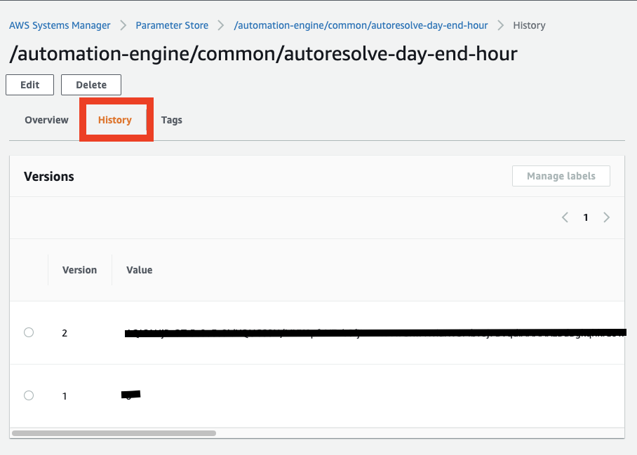

# AC-2 Account Management
## AC-2(1) Account Management | Automated System Account Management
#### 1.1 Description
Support the management of system accounts using [GSA S/SO or Contractor recommended automated mechanisms as approved by the GSA CISO and AO]
#### 1.2 Implementation
Accounts are managed by Okta software connected to AWS IAM identity provider, the configurations used are following [this guide](../manual_configurations/OKTA_CONFIGURATIONS.md)

## AC-2(2) Account Management | Automated Temporary and Emergency Account Management
#### 2.1 Description
Automatically [disables] temporary and emergency accounts after [no more than 90 days].
#### 2.2 Implementation
Accounts are managed by Okta software.
#### 2.3 Procedure
MetTel is in charge of creation, deactivation or deleting users in their organization. Temporary accounts and emergency accounts must be managed manually by MetTel and the deactivation of these kind of accounts.
#### 2.4 Testing
After deactivating a user following this [Link to Okta](https://help.okta.com/en-us/Content/Topics/users-groups-profiles/usgp-deactivate-user-account.htm) go to
the AWS account and check under this [link to IAM Identity center](https://us-east-1.console.aws.amazon.com/singlesignon/identity/home) and check the deactivated user.

## AC-2(3) Account Management | Disable Accounts
#### 3.1 Description
Disable accounts within [30 days] when the accounts:
(a)        Have expired;
(b)        Are no longer associated with a user or individual;
(c)        Are in violation of organizational policy; or
(d)        Have been inactive for [30 days].
#### 3.2 Implementation
Accounts are managed by Okta software. An account that was disabled from Okta will be disabled on AWS when Expired, no longer associated with a user or individual, violation of a organization policy or have been inactive for 30 days.
#### 3.3 Procedure
MetTel is in charge of creation, deactivation or deleting users in their organization. Each of these actions are automatically replicated to the connected AWS account with the Oauth Okta system and AWS. 
#### 3.4 Testing
After deactivating a user following this [Link to Okta](https://help.okta.com/en-us/Content/Topics/users-groups-profiles/usgp-deactivate-user-account.htm) go to
the AWS account and check under this [link to IAM Identity center](https://us-east-1.console.aws.amazon.com/singlesignon/identity/home) and check the deactivated user.
#### 3.5 Extra information and links
- [Deactivate and delete users accounts](https://help.okta.com/en-us/Content/Topics/users-groups-profiles/usgp-deactivate-user-account.htm)
- [OKTA AWS IDP](https://docs.aws.amazon.com/singlesignon/latest/userguide/okta-idp.html)

## AC-2(4) Account Management | Automated Audit Actions
#### 4.1 Description
Automatically audit account creation, modification, enabling, disabling, and removal actions.
#### 4.2 Implementation
The implemation of the audit of the account is automatically enabled by AWS.
#### 4.3 Testing
Following the next [link to cloudtrail](https://us-east-1.console.aws.amazon.com/cloudtrail/home) is posible to query the user events and actions. 
#### 4.4 Extra information and links
- [AWS Security logging and monitoring](https://docs.aws.amazon.com/singlesignon/latest/userguide/security-logging-and-monitoring.html)
- [AWS logging cloudtrail](https://docs.aws.amazon.com/singlesignon/latest/userguide/logging-using-cloudtrail.html)
- [AWS Cloudwatch integration](https://docs.aws.amazon.com/singlesignon/latest/userguide/cloudwatch-integration.html)

## AC-2(5) Account Management | Inactivity Logout
#### 5.1 Description
Require that users log out when [they have completed their workday].
#### 5.2 Implementation
This points must be done by loging out by the user from the laptops computers provided by MetTel.

# AC-3 Access Enforcement
#### 1.1 Description
Enforce approved authorizations for logical access to information and system resources in accordance with applicable access control policies.
#### 1.2 Implementation
To enforce the authorizations to access information and system resources, the project hast 4 groups, 2 privileged groups and another 2 groups with non privileged permisions. These groups are:
- OKTA-IPA-FED-INT-PRIVILEGED: Privileged MetTel users.
- OKTA-IPA-FED-INT-NON-PRIVILEGED: Non privileged MetTel users.
- OKTA-IPA-FED-EXT-PRIVILEGED: privileged contractor users.
- OKTA-IPA-FED-EXT-NON-PRIVILEGED: non privileged contractors users.
#### 1.3 Extra information and links
- [API Permissions](https://docs.aws.amazon.com/AWSEC2/latest/APIReference/ec2-api-permissions.html)
- [IAM identity central groups administration page](https://us-east-1.console.aws.amazon.com/singlesignon/identity/home?region=us-east-1#!/groups)

# AC-4 Access Enforcement
#### 1.1 Description
Enforce approved authorizations for controlling the flow of information within the system and between connected systems based on [Web Service Security (WS Security), WS-Security Policy, WS Trust, WS Policy Framework, Security Assertion Markup Language (SAML), extensible Access Control Markup Language (XACML)].
#### 1.2 Implementation
The enforced authorization are made by Okta and the groups configured in AWS Identity center. Only administrator groups can create/modify/delete information flows but is not recommended doing it in that way because almost everything was made with infrastructure as a code. All
the security groups are wrote on code and the modification of these securities groups should be made with git and a redeployment of the infrastructure.

# AC-6 Least Privilege
#### 1. Least Privilege
#### 1.1 Description
Enforce approved authorizations for controlling the flow of information within the system and between connected systems based on [Web Service Security (WS Security), WS-Security Policy, WS Trust, WS Policy Framework, Security Assertion Markup Language (SAML), extensible Access Control Markup Language (XACML)].
#### 1.2 Links
- [IAM Administrator group logs ](https://us-east-1.console.aws.amazon.com/iamv2/home#/groups/details/Administrators?section=access_advisor)

#### 2. AC-6(1) Least Privilege | Authorize Access to Security Functions
#### 2.1 Description
Authorize access for [any individual or role] to: 
(a)        [GSA S/SO or Contractor recommended security functions (deployed in hardware, software, and firmware) approved by the GSA CISO and AO]; and 
(b)        [Security-relevant information as approved by the GSA CISO and AO].
#### 2.2 Implementation
Priviliged accounts/roles on the system are restricted to the recomended employees and contrators to access recomended security functions and security relevant information.
#### 2.1 Implementation
Only contractors recomended by MetTel and GSA are explicitly authorized access to all functions and security-relevant information associated with their systems that are not publicly available.

#### 3. AC-6(2) Least Privilege |  Non-privileged Access for Nonsecurity Functions
#### 3.1 Description
Require that users of system accounts (or roles) with access to [all security functions (examples of security functions include but are not limited to: establishing system accounts, configuring access authorizations (i.e., permissions, privileges), setting events to be audited, and setting intrusion detection parameters, system programming, system and security administration, other privileged functions)] use non-privileged accounts or roles, when accessing nonsecurity functions.
#### 3.2 Implementation
This is manually configured with specific groups on IAM Indentity center with no privileged credentials, these groups are asociated to users(from Okta), these are not allowed to execute or see privileged resources/functions.

#### 4. AC-6(5) Least Privilege | Privileged Accounts
#### 4.1 Description
Restrict privileged accounts on the system to [GSA S/SO or Contractor recommended employees and contractors as approved by the GSA CISO and AO].
#### 4.2 Implementation
Priviliged accounts on the system are restricted to the recomended employees and contrators organized by MetTel with Okta Software and AWS groups. Only users in these groups can access priviliged accounts:
- OKTA-IPA-FED-INT-PRIVILEGED
- OKTA-IPA-FED-EXT-PRIVILEGED

#### 5. AC-6(9) Least Privilege | Log Use of Privileged Functions
#### 5.1 Description
Log the execution of privileged functions.
#### 5.2 Implementation
All functions used are throwing logs on [cloudwatch](https://us-east-1.console.aws.amazon.com/cloudwatch/home). The functions that the project is using are AWS Lambdas, codepipeline and user functions. Also the change of System manager parameters are logged in each specific parameter in their history secction as the next image(Each parameter has their own history section):

#### 5. AC-6(10) Prohibit Non-privileged Users from Executing Privileged Functions
#### 5.1 Description
Prevent non-privileged users from executing privileged functions.
#### 5.2 Implementation
This is manually configured with specific groups on IAM Indentity center with no privileged credentials, these groups are asociated to users(from Okta), these are not allowed to execute or see privileged resources/functions that should be visible only with privileges. The associated groups with no privilages are OKTA-IPA-FED-INT-NON-PRIVILEGED and OKTA-IPA-FED-EXT-NON-PRIVILEGED. More information about the groups [here](../manual_configurations/OKTA_CONFIGURATIONS.md#steps)

# AC-7 Unsuccessful Logon Attempts
#### 1 Description
a. Enforce a limit of [not more than ten (10) failed access attempts] consecutive invalid logon attempts by a user during a [30 minute time period]; and
b. Automatically [locks the account node for [30 minutes]] when the maximum number of unsuccessful attempts is exceeded.
#### 2 Implementation
The enforce of a limit on logon attemps is implemented by MetTel from Okta to access from IAM identity central. There are 2 main accounts needed from AWS that does not comes from Okta and Identity central, a MetTel main root account that has access to everything and a deployment account to deploy infra as a code. It´s not posible to limit the number of attempts because AWS does not support this [behaviour](https://docs.aws.amazon.com/IAM/latest/UserGuide/id_credentials_passwords_account-policy.html#password-policy-rules).

# AC-8 System Use Notification
#### 1 Description
a.        Display [a system use notification message or banner as defined in GSA Order CIO 2100.1] to users before granting access to the system that provides privacy and security notices consistent with applicable laws, executive orders, directives, regulations, policies, standards, and guidelines and state that:
1.        Users are accessing a U.S. Government system;
2.        System usage may be monitored, recorded, and subject to audit;
3.        Unauthorized use of the system is prohibited and subject to criminal and civil penalties; and
4.        Use of the system indicates consent to monitoring and recording;
b.        Retain the notification message or banner on the screen until users acknowledge the usage conditions and take explicit actions to log on to or further access the system; and
c.        For publicly accessible systems:
1.        Displays system use information [when accessed via logon interfaces with human users], before granting further access;
2.        Displays references, if any, to monitoring, recording, or auditing that are consistent with privacy accommodations for such systems that generally prohibit those activities; and
3.        Includes a description of the authorized uses of the system.
#### 2 Implementation
The display of system use notifications are managed by MetTel and the laptops that they provide to access their systems. We don't have direct connexions to machines by SSH or any remote access to servers on this infrastructure.

# AC-12 Session Termination
#### 1 Description
Automatically terminate a user session after [(1) 30 minutes of inactivity (2) the following timeframes, regardless of user activity: a. Thirty (30) days for systems at AAL1 b. Twelve (12) hours for systems at AAL2 and AAL3]. Note: AAL2 and AAL3 require Two Factor Authentication].
#### 2 Implementation
To enforce a session termination MetTel implemented Okta users central system conected to their VPN and plataformed laptops. MetTel has the control of the session termination with the two factor aunthentication implemented with Okta.

# AC-17 Remote Access
#### 1 Description
Automatically terminate a user session after [(1) 30 minutes of inactivity (2) the following timeframes, regardless of user activity: a. Thirty (30) days for systems at AAL1 b. Twelve (12) hours for systems at AAL2 and AAL3]. Note: AAL2 and AAL3 require Two Factor Authentication].
#### 2 Implementation
To enforce a session termination MetTel implemented Okta users central system conected to their VPN and plataformed laptops. MetTel has the control of the session termination with the two factor aunthentication implemented with Okta. In the other hand, AWS contected to Okta has 24h token sessions but operators must access AWS accounts from the plataformed laptops.

# AC-17(1) Remote Access | Monitoring and Control
#### 1 Description
Employ automated mechanisms to monitor and control remote access methods.
#### 2 Implementation

# AC-17(2) Remote Access | Protection of Confidentiality and Integrity Using Encryption
#### 1 Description
Implement cryptographic mechanisms to protect the confidentiality and integrity of remote access sessions.
#### 2 Implementation

# AC-17(3) Remote Access | Managed Access Control Points
#### 1 Description
Route remote accesses through authorized and managed network access control points.
#### 2 Implementation

# AC-17(4) Remote Access | Privileged Commands and Access
#### 1 Description
(a) Authorize the execution of privileged commands and access to security-relevant information via remote access only in a format that provides assessable evidence and for the following needs: [S/SO or contractor recommended and GSA CISO and AO approved special cases for remote administration and maintenance tasks]; and
(b) Document the rationale for remote access in the security plan for the system.
#### 2 Implementation

# AC-20(1) Use of External Systems | Limits on Authorized Use
#### 1 Description
Permit authorized individuals to use an external system to access the system or to process, store, or transmit organization-controlled information only after:
(a)        Verification of the implementation of controls on the external system as specified in the organization’s security and privacy policies and security and privacy plans; or
(b)        Retention of approved system connection or processing agreements with the organizational entity hosting the external system.
#### 2 Implementation
