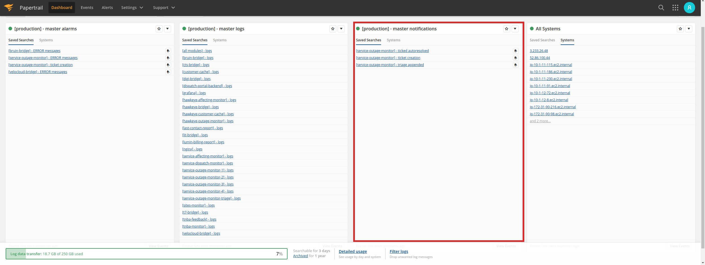

<div align="center">

</div>

# Logging and Monitoring

## Cloudwatch

### Cloudwatch Log Groups

A log group is created in [Cloudwatch](https://docs.aws.amazon.com/cloudwatch/index.html) for the different environments deployed in AWS:

- **Production environment**: A log group will be created with the name `automation-master` in which the different [logStreams](https://docs.aws.amazon.com/AmazonCloudWatch/latest/logs/Working-with-log-groups-and-streams.html) will be created to store the logs of the different ECS services for the production environment.

- **Ephemeral environments**: A `log group` will be created with the name `automation-<branch_identifier>` for ephemeral environments, being `branch_identifier` the result of applying `echo -n "<branch_name>" | sha256sum | cut -c1-8` on the branch name related to the ephemeral environment, the [logStreams](https://docs.aws.amazon.com/AmazonCloudWatch/latest/logs/Working-with-log-groups-and-streams.html) required for the different ECS services deployed in that environment will be created using the mentioned `log group`.

### Cloudwatch Log Streams

As mentioned in the previous section, the different [logStreams](https://docs.aws.amazon.com/AmazonCloudWatch/latest/logs/Working-with-log-groups-and-streams.html) of the deployed services will be stored in a specific `logGroup` for each environment. A logStream will be created for each of the ECS cluster services tasks created in each environment, which will follow the following scheme

```sh
<environment_name>-<microservice_image_build_number>/<microservice_name>/<ecs_tasks_id>
```

- `environment_name`: The names for environments are `automation-master` for production, as well as `automation-<branch_identifier>` for ephemeral environments, being `branch_identifier` the result of applying `echo -n "<branch_name>" | sha256sum | cut -c1-8` on the branch name related to the ephemeral environment.

- `microservice_image_build_number`: The pipeline number is used as build number to build the image of those microservices that need to build a new docker image.

- `microservice_name`: The name of the microservice deployed in ECS, e.g. `bruin-bridge`.

- `ecs_task_id>`: For each ECS service, one or several tasks are created, depending on the desired number in the service, these tasks are identified with an identifier formed by number and letters, e.g. `961ef51b61834a2e9dd804db564a9fe0`.

### Cloudwatch Retention Period

All environments deployed on AWS have been configured to use [Cloudwatch](https://docs.aws.amazon.com/cloudwatch/index.html) to record the logs of the microservices present in them, although it is important to note the following differences:

- **Production environment**: The retention period of the log group created for such an environment is 90 days.

- **Ephemeral environments**: The retention period of the log group created for such an environment is 14 days.

> This retention period is configured in the [infra-as-code/dev/logs.tf](../infra-as-code/dev/logs.tf) file.

### Cloudwatch logs retrieval tool

It is possible to obtain the events in logs of a logGroup through a tool designed for this purpose available in Github called [log-stream-filter](https://github.com/xoanmm/log-stream-filter).

#### Download and install

This tool is available for Linux, MacOS and Windows, it is possible to download the latest binary for each of these OSs:

- **Linux**:

    - It's possible download and install as a `deb` package
        ```sh
        curl -o log-stream-filter.deb -L $(curl -s https://api.github.com/repos/xoanmm/log-stream-filter/releases/latest | jq -r '.assets[] | select(.name | contains("linux_amd64.deb")) | .browser_download_url')
        sudo dpkg -i log-stream-filter.deb
        ```
    - It's also possible download and install as a simple binary
        ```sh
        curl -o log-stream-filter.tgz -L $(curl -s https://api.github.com/repos/xoanmm/log-stream-filter/releases/latest | jq -r '.assets[] | select(.name | contains("linux_64-bit.tar.gz")) | .browser_download_url')
        tar -zxvf log-stream-filter.tgz
        chmod +x ./log-stream-filter && sudo mv ./log-stream-filter /usr/local/bin
        ```
- **MacOS**:

    ```sh
    curl -o log-stream-filter.tgz -L $(curl -s https://api.github.com/repos/xoanmm/log-stream-filter/releases/latest | jq -r '.assets[] | select(.name | contains("macOS")) | .browser_download_url')
    tar -zxvf log-stream-filter.tgz
    chmod +x ./log-stream-filter && sudo mv ./log-stream-filter /usr/local/bin
    ```

- **Windows**:

    ```sh
    curl -o log-stream-filter.zip -L $(curl -s https://api.github.com/repos/xoanmm/log-stream-filter/releases/latest | jq -r '.assets[] | select(.name | contains("windows")) | .browser_download_url')
    unzip log-stream-filter.zip
    ```

#### Example of usage

- Example of search text `Outage monitoring process finished` between `04/06/2021 12:00:00` and `04/07/2021 12:00:00` in log group with name `automation-master` for log streams that match with name `service-outage-monitor-1` using AWS profile with name `mettel-automation`:
    ```sh
    $ log-stream-filter -n "automation-master" -l "service-outage-monitor-1" -a "mettel-automation" -s "04/06/2021 12:00:00" -e "04/07/2021 12:00:00" -T "Outage monitoring process finished" -t true
    Filtering logs for logGroup automation-master
    params: [aws-profile mettel-automation] [log-stream-filter: service-outage-monitor-1] [search-term-search: true] [search-term: Outage monitoring process finished] [path: /tmp] [start-date: 04/06/2021 12:00:00] [end-date: 04/07/2021 12:00:00]
    Getting logStreams for logGroup automation-master applying filter service-outage-monitor-1
    Getting the logEvents for those logStreams whose last event was inserted between 04/06/2021 12:00:00 and 04/07/2021 12:00:00
    ****************************************************************************************************
    LogStreamName: automation-master-75993/service-outage-monitor-1/75d4e2cbb3f64e84a97063d34ffe6177
    CreationTime: 04/05/2021 23:08:29
    LastEventTime: 04/06/2021 12:43:49
    All log events are going to be retrieved in logGroup automation-master for logStream automation-master-75993/service-outage-monitor-1/75d4e2cbb3f64e84a97063d34ffe6177 from time 1617710400000
    Event messages for stream automation-master-75993/service-outage-monitor-1/75d4e2cbb3f64e84a97063d34ffe6177 in log group automation-master are going to be saved in the following files
    - /tmp/automation-master-75993_service-outage-monitor-1_75d4e2cbb3f64e84a97063d34ffe6177-Outage_monitoring_process_finished
    ****************************************************************************************************
    ****************************************************************************************************
    LogStreamName: automation-master-76009/service-outage-monitor-1/aab10e3e029c44fcb08dddeb51431fa2
    CreationTime: 04/06/2021 12:44:40
    LastEventTime: 04/07/2021 10:39:16
    All log events are going to be retrieved in logGroup automation-master for logStream automation-master-76009/service-outage-monitor-1/aab10e3e029c44fcb08dddeb51431fa2 from time 1617710400000
    Event messages for stream automation-master-76009/service-outage-monitor-1/aab10e3e029c44fcb08dddeb51431fa2 in log group automation-master are going to be saved in the following files
    - /tmp/automation-master-76009_service-outage-monitor-1_aab10e3e029c44fcb08dddeb51431fa2-Outage_monitoring_process_finished
    ****************************************************************************************************
    ****************************************************************************************************
    LogStreamName: automation-master-76051/service-outage-monitor-1/c921aa5c9bf04d71b0fab6d8673946a3
    CreationTime: 04/07/2021 10:41:22
    LastEventTime: 04/07/2021 11:04:33
    All log events are going to be retrieved in logGroup automation-master for logStream automation-master-76051/service-outage-monitor-1/c921aa5c9bf04d71b0fab6d8673946a3 from time 1617710400000
    Event messages for stream automation-master-76051/service-outage-monitor-1/c921aa5c9bf04d71b0fab6d8673946a3 in log group automation-master are going to be saved in the following files
    - /tmp/automation-master-76051_service-outage-monitor-1_c921aa5c9bf04d71b0fab6d8673946a3-Outage_monitoring_process_finished
    ****************************************************************************************************
    3 files generated for logs of logStreams filtered for logGroup automation-master
    Location of files where logs of logStream automation-master-75993/service-outage-monitor-1/75d4e2cbb3f64e84a97063d34ffe6177 were stored are the following
    - /tmp/automation-master-75993_service-outage-monitor-1_75d4e2cbb3f64e84a97063d34ffe6177-Outage_monitoring_process_finished
    Location of files where logs of logStream automation-master-76009/service-outage-monitor-1/aab10e3e029c44fcb08dddeb51431fa2 were stored are the following
    - /tmp/automation-master-76009_service-outage-monitor-1_aab10e3e029c44fcb08dddeb51431fa2-Outage_monitoring_process_finished
    Location of files where logs of logStream automation-master-76051/service-outage-monitor-1/c921aa5c9bf04d71b0fab6d8673946a3 were stored are the following
    - /tmp/automation-master-76051_service-outage-monitor-1_c921aa5c9bf04d71b0fab6d8673946a3-Outage_monitoring_process_finished
    ```

> To know all the options it is recommended to read the [README](https://github.com/xoanmm/log-stream-filter/blob/master/README.md) of [log-stream-filter](https://github.com/xoanmm/log-stream-filter) in github.

## Papertrail

There is a [papertrail](https://papertrailapp.com/) account used in the project for sending logs, **but it will only be used for the production environment**, this is because it is a high cost service and it is not feasible to have an account for all ephemeral environments due to its cost and the high volume of logs generated in these environments.

### Papertrail dashboards

The system logs of the production environment are stored in papertrail, the account credentials are in the project's onepassword vault to which all people in the project have access.

Below is a screenshot of the main screen of the system.


In this system it's possible see three useful dashboards:

- **[production] - master alarms**: alarms are defined on different modules with notifications sent to slack through the mettel-alarms-papertrail-production channel, for example when the number of error messages in a module exceeds 100 times in an hour. Below is a screenshot where these alarms have been marked in a red rectangle.

    

- **[production] - master logs**: searches are defined to gather the logs of the replicas of each deployed microservice. Below is a screenshot where these searches have been marked in a red rectangle.

    

- **[production] - master notifications**: Searches on different modules are defined with their notification to slack through the mettel-notifications-papertrail-production channel. Below is a screenshot where these searches have been marked in a red rectangle.

    

### Papertrail logging configuration

A certain configuration must be made for the microservices to use papertrail for sending logs in production, this configuration is made in the `LOG_CONFIG` section of the `config.py` file present in the `src/config` folder of each microservice, this configuration is shown below:

```sh
LOG_CONFIG = {
    'name': '<microservice_name>',
    'level': logging.DEBUG,
    'stream_handler': logging.StreamHandler(sys.stdout),
    'format': f'%(asctime)s: {ENVIRONMENT_NAME}: %(hostname)s: %(module)s::%(lineno)d %(levelname)s: %(message)s',
    'papertrail': {
        'active': True if os.getenv('PAPERTRAIL_ACTIVE') == "true" else False,
        'prefix': os.getenv('PAPERTRAIL_PREFIX', f'{ENVIRONMENT_NAME}-<microservice_name>'),
        'host': os.getenv('PAPERTRAIL_HOST'),
        'port': int(os.getenv('PAPERTRAIL_PORT'))
    },
}
```
> It would be necessary to put the microservice name instead of `microservice_name` for each microservice in the project

### Papertrail searches configuration

The [papertrail-provisioning](../ci-utils/papertrail-provisioning) tool is available in the repository to configure the different groups of searches in papertrail, you must follow the procedure explained in the [README](../ci-utils/papertrail-provisioning/README.md) of the same for its use.

> The above mentioned guide should be followed to add log searches for a specific microservice, it is also possible to configure alarms that will send notifications to slack.