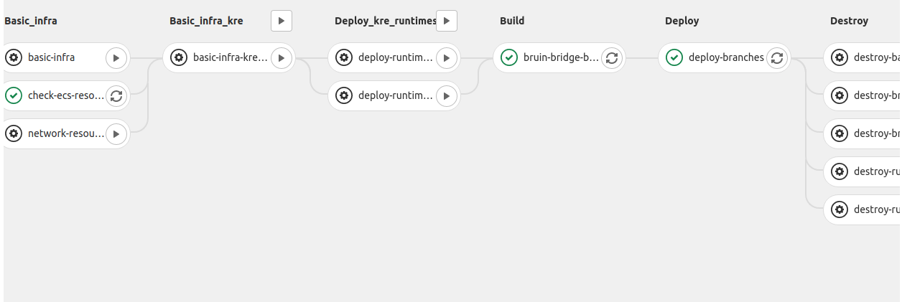

# Pipelines

In this project is implemented Software delivery with total automation, thus avoiding manual intervention and therefore human errors in our product.

Human error can and does occur when carrying out these boring and repetitive tasks manually and ultimately does affect the ability to meet deliverables.

All of the automation is made with Gitlab CI technology, taking advantage of all the tools that Gitlab has.
We separate the automatation in two parts, [continuous integration](#continuous-integration-ci) and [continuous delivery](#continuous-delivery-cd), that are explained in the next sections.

# Environments

In the project there are two types of environments in the project:

* **Production**: The environment is related to everything currently running in AWS related to the latest version of the `master` branch of the repository.

* **Ephemerals**: These environments are created from branches that start with name `dev/feature` or `dev/fix`.

>The name of any environment, regardless of the type, will identify all the resources created in the deployment process. The names for environments are `automation-master` for production, as well as `automation-<branch_identifier>` for ephemeral environments, being `branch_identifier` the result of applying `echo -n "<branch_name>" | sha256sum | cut -c1-8` on the branch name related to the ephemeral environment. These names will identify all the resources created in AWS during the [continuous delivery](#continuous-delivery-cd) process, explained in the following sections.

# Continuous integration (CI)

> Continuous Integration (CI) is a development practice where developers integrate code into a shared repository frequently, preferably several times a day. Each integration can then be verified by an automated build and automated tests. While automated testing is not strictly part of CI it is typically implied.
> [Codeship](https://codeship.com/continuous-integration-essentials)

## Validation steps

This stage checks that all services comply with the rules of [PEP8](https://www.python.org/dev/peps/pep-0008/#package-and-module-names), as well as whether the Terraform files used to configure the infrastructure are valid from a syntactic point of view.

## Unit tests steps

All the available unit tests for each service should be run in this stage of the CI process.

If the coverage obtained from these tests for a service is not greater than or equal to 80%, it will cause this phase to fail, this will mean that the steps of the next stage will not be executed and the process will fail.

In cases in which a module does not reach the minimum coverage mentioned above, a message like the following will be seen in the step executed for that module.

# Continuous delivery (CD)

> Continuous deployment is the next step of continuous delivery: Every change that passes the automated tests is deployed to production automatically. Continuous deployment should be the goal of most companies that are not constrained by regulatory or other requirements.
> [Puppet.com](https://puppet.com/blog/continuous-delivery-vs-continuous-deployment-what-s-diff)

## Basic_infra steps

This area covers the checking and creation, if necessary, of all the basic resources for the subsequent deployment, these being the specific image repositories in [ECR Docker Container Registry](https://aws.amazon.com/ecr), as well as the roles necessary in AWS to be able to display these images in [ECS Container Orchestrator](https://aws.amazon.com/ecs/).

In this stage is also checked whether there are enough free resources in ECS to carry out the deployment with success or not.

## Build steps

This area will cover all build steps of all necessary modules to deploy the app to the selected environment. It's typical to build the docker images and push to the repository in this step.

## Deploy steps

In these works  *MetTel Automation* modules in the monorepo will be deployed to the selected environment, as well as all the resources associated to that environment in AWS.

In these jobs services in the monorepo will be deployed to the selected environment. The deploy steps will deploy the following in AWS:

* An [ECS Cluster](https://docs.aws.amazon.com/AmazonECS/latest/developerguide/ECS_clusters.html) will be created for the environment with a set of resources

  * An [ECS Service](https://docs.aws.amazon.com/AmazonECS/latest/developerguide/ecs_services.html) that will use the new Docker image uploaded for each service of the project, being these services the specified below:

    * [bruin-bridge](../bruin-bridge)

    * [las-contact-report](../last-contact-report)

    * [metrics-grafana](../metrics-dashboard/grafana)

    * [metrics-prometheus](../metrics-dashboard/prometheus)

    * [nats-server, nats-server-1, nats-server-2](../nats-server)

    * [notifier](../notifier)

    * [service-affecting-monitor](../service-affecting-monitor)

    * [service-outage-monitor](../service-outage-monitor)

    * [service-outage-triage](../service-outage-triage)

    * [t7-bridge](../t7-bridge)

    * [velocloud-bridge](../velocloud-bridge)

    * [sites-monitor](../sites-monitor)

  * A [Task Definition](https://docs.aws.amazon.com/AmazonECS/latest/developerguide/example_task_definitions.html) for each of the above *ECS Services*

In this process, a series of resources will also be created in AWS for the selected environment, as follows:

* An [ElastiCache Redis Cluster](https://docs.aws.amazon.com/AmazonElastiCache/latest/red-ug/WhatIs.html)

* An [ALB](https://docs.aws.amazon.com/elasticloadbalancing/latest/application/introduction.html)

* A [record](https://docs.aws.amazon.com/Route53/latest/DeveloperGuide/rrsets-working-with.html) in [Route53](https://aws.amazon.com/route53/features/)

* A [CloudWatch Log Group](https://docs.aws.amazon.com/AmazonCloudWatch/latest/logs/CloudWatchLogsConcepts.html)

* An [Service Discovery Service](https://aws.amazon.com/blogs/aws/amazon-ecs-service-discovery/) for each ECS Service of the ECS Cluster created for this environment and a [Service Discovery Namespace](https://docs.aws.amazon.com/AmazonECS/latest/developerguide/service-discovery.html) to logically group these *Service Discovery Services*.

* A set of resources related to the metrics of the environment:

  * [CloudWatch Alarms](https://docs.aws.amazon.com/AmazonCloudWatch/latest/monitoring/AlarmThatSendsEmail.html)

  * [CloudWatch Dashboard](https://docs.aws.amazon.com/AmazonCloudWatch/latest/monitoring/CloudWatch_Dashboards.html)

  * [CloudWatch Log Filters](https://docs.aws.amazon.com/AmazonCloudWatch/latest/logs/FilterAndPatternSyntax.html)

* A [CloudFormation Stack](https://docs.aws.amazon.com/AWSCloudFormation/latest/UserGuide/stacks.html) for create the [SNS topic](https://docs.aws.amazon.com/AWSCloudFormation/latest/UserGuide/aws-properties-sns-topic.html) that will be used by *CloudWatch Alarms* notifications of this environment

## Grafana user creation steps

This area will cover the creation of a set os users in the Grafana Service created for the environment that is being used in this deployment.

---
With passion from the [Intelygenz](https://www.intelygenz.com) Team @ 2019