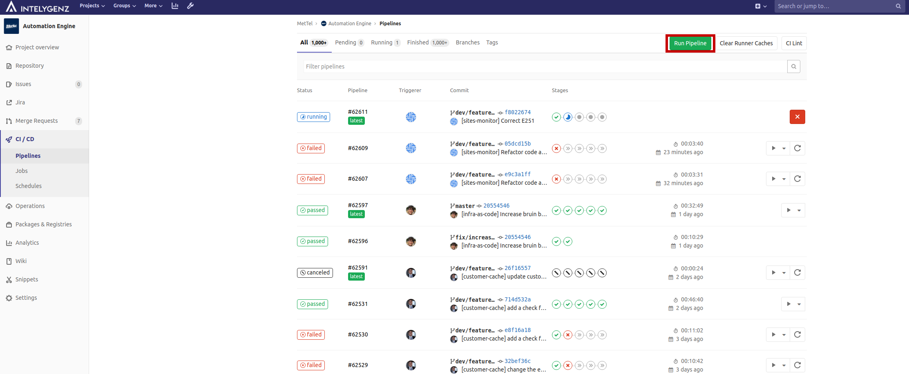
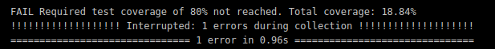

<div align="center">

</div>

# Pipelines

In this project is implemented Software delivery with total automation, thus avoiding manual intervention and therefore human errors in our product.

Human error can and does occur when carrying out these boring and repetitive tasks manually and ultimately does affect the ability to meet deliverables.

All of the automation is made with Gitlab CI technology, taking advantage of all the tools that Gitlab has.
We separate the automatation in two parts, [continuous integration](#continuous-integration-ci) and [continuous delivery](#continuous-delivery-cd), that are explained in the next sections.

To improve the speed and optimization of the pipelines, **only the jobs and stages will be executed on those modules that change in each commit**.

## Launch all jobs in a pipeline

**Exceptionally, it is possible to launch a pipeline with all the jobs and stages on a branch using the web interface, as shown in the following image**. To do so, the following steps must be followed:

   1. From the project repository select the `CI/CD` option in the left sidebar and this `Pipelines`, as shown in the following image where these options are marked in red.
   
   
   2. Choose the `Run Pipeline` option, as shown in the image below in red.
   
   
   3. Indicate the branch where you want to run the pipeline in the `Run for` box and then click on `Run pipeline`. It's possible see an example in the following image, where the box `Run for` is shown in green and `Run pipeline` is shown in red.
   

   > It is important to note that due to the extra time added by the tests of the `dispacth-portal-frontend` microservice, the tests of this one will only be executed when any of the files within it change or a pipeline with the Gitlab variable `TEST_DISPATCH_PORTAL_FRONTEND` with value `true` is executed.

## Environments

### Microservices Environments

For the microservices there are the following environments

* **Production**: The environment is related to everything currently running in AWS related to the latest version of the `master` branch of the repository.

* **Ephemerals**: These environments are created from branches that start with name `dev/feature` or `dev/fix`.

>The name of any environment, regardless of the type, will identify all the resources created in the deployment process. The names for environments are `automation-master` for production, as well as `automation-<branch_identifier>` for ephemeral environments, being `branch_identifier` the result of applying `echo -n "<branch_name>" | sha256sum | cut -c1-8` on the branch name related to the ephemeral environment. These names will identify all the resources created in AWS during the [continuous delivery](#continuous-delivery-cd) process, explained in the following sections.

### KRE Environments

For [KRE](https://konstellation-io.github.io/website/) component there are the following environments: 

- **dev**: This will be used for the various tests and calls made from the project's microservices in any **ephemeral environment**, ie from the microservices deployed in the ECS cluster with name `automation-<environment_id>`.

* **production**: This will be used for the different calls made from the project's microservices in the **production environment**, that is, from the microservices deployed in the ECS cluster with the name `automation-master`.

## Continuous integration (CI)

> Continuous Integration (CI) is a development practice where developers integrate code into a shared repository frequently, preferably several times a day. Each integration can then be verified by an automated build and automated tests. While automated testing is not strictly part of CI it is typically implied.
> [Codeship](https://codeship.com/continuous-integration-essentials)


### Validation steps

This stage checks the following:

* All python microservices comply with the rules of [PEP8](https://www.python.org/dev/peps/pep-0008/#package-and-module-names)

* Terraform files used to configure the infrastructure are valid from a syntactic point of view.

* The frontend modules comply with the linter configured for them

### Unit tests steps

All the available unit tests for each service should be run in this stage of the CI process.

If the coverage obtained from these tests for a service is not greater than or equal to 80%, it will cause this phase to fail, this will mean that the steps of the next stage will not be executed and the process will fail.

In cases in which a module does not reach the minimum coverage mentioned above, a message like the following will be seen in the step executed for that module.



## Continuous delivery (CD)

> Continuous deployment is the next step of continuous delivery: Every change that passes the automated tests is deployed to production automatically. Continuous deployment should be the goal of most companies that are not constrained by regulatory or other requirements.
> [Puppet.com](https://puppet.com/blog/continuous-delivery-vs-continuous-deployment-what-s-diff)


### Basic_infra steps

This area covers the checking and creation, if necessary, of all the basic resources for the subsequent deployment, these being the specific image repositories in [ECR Docker Container Registry](https://aws.amazon.com/ecr), as well as the roles necessary in AWS to be able to display these images in [ECS Container Orchestrator](https://aws.amazon.com/ecs/).

In this stage there is also a job that must be executed manually if necessary, this is responsible for checking and creating if necessary network resources for the production environment or ephemeral environments.

In this stage is also checked whether there are enough free resources in ECS to carry out the deployment with success or not.

**It's necessary run the `basic-infra` job the first time a new microservice is created in the project**
> This has been done because ECR repositories are global resources and are stored in the same `tfstate` file, thus avoiding that when a microservice that creates a repository is created, it is not deleted by other branches that do not have it added.

### Basic_infra_kre steps

In this stage will be the following jobs:
* `deploy-basic-infra-kre-dev` for ephemeral environments and `deploy-basic-infra-kre-production` for the production environment, **these are executed optionally manually**.

  This job is reponsible of checking and creation, if necessary, of the EKS cluster used by KRE in each environment and all the necessary resources related (RBAC configuration, helm charts needed for the KRE runtimes, etc)

  The process followed in this job is as follows:

  1. The necessary infrastructure is created in AWS for KRE, creating for them the following components:

     - An S3 bucket for each environment and save information about the cluster, such as the SSH key to connect to the nodes.

     - An [EKS cluster](https://docs.aws.amazon.com/eks/latest/userguide/clusters.html) to be able to deploy the different KRE components designed for Kubernetes

     - An [AutoScaling Group](https://docs.aws.amazon.com/autoscaling/ec2/userguide/AutoScalingGroup.html) to have the desired number of Kubernetes worker nodes

     - A SMTP service through [Amazon SES](https://aws.amazon.com/ses/) and all the necessary componentes of it

     - A set of IAM roles, one for each user with access to the project. These will be used to assign subsequent permissions in the Kubernetes cluster according to the role they belong to. These are stored as terraform [output values](https://www.terraform.io/docs/configuration/outputs.html), saving the list of user roles belonging to each role in their corresponding variable.
     
       Below is an example of a pipeline execution where it's possible see the IAM roles of users generated for each role in the project:

       ```sh
       Outputs:
        eks_developer_ops_privileged_roles = [
          "arn:aws:iam::374050862540:role/eks-developer-ops-mettel-automation-kre-xisco.capllonch",
          "arn:aws:iam::374050862540:role/eks-developer-ops-mettel-automation-kre-xoan.mallon.developer",
        ]
        eks_developer_roles = [
          "arn:aws:iam::374050862540:role/eks-developer-mettel-automation-kre-brandon.samudio",
          "arn:aws:iam::374050862540:role/eks-developer-mettel-automation-kre-daniel.fernandez",
          "arn:aws:iam::374050862540:role/eks-developer-mettel-automation-kre-joseluis.vega",
          "arn:aws:iam::374050862540:role/eks-developer-mettel-automation-kre-marc.vivancos",
        ]
        eks_devops_roles = [
          "arn:aws:iam::374050862540:role/eks-devops-mettel-automation-kre-alberto.iglesias",
          "arn:aws:iam::374050862540:role/eks-devops-mettel-automation-kre-angel.costales",
          "arn:aws:iam::374050862540:role/eks-devops-mettel-automation-kre-angel.luis.piquero",
        ]
       ```
    
      - A set of helm charts necessary for any KRE runtime:

        1. **external-dns**, using the helm chart from [bitnami repository](https://charts.bitnami.com/bitnami)

            `external-dns` is a Kubernetes addon that configures public DNS servers with information about exposed Kubernetes services to make them discoverable. It allows in a simple way that through the creation of an ingress in AWS you can create an entry in Route53 of type alias so that the calls to that ingress redirect to the value configured for the alias, being the most typical the DNS of the balancer created by the ingress.
        
        2. **cert-mananger**, using the helm chart from [jetstack repository](https://charts.jetstack.io).

            This component automate the management lifecycle of all required certificates used by the KRE component in each environment.

        3. **nginx ingress controller**, using the helm chart from [ingress-nginx repository](https://kubernetes.github.io/ingress-nginx).

            A series of configurations are provided so that the IP of clients in Kubernetes services can be known, since by default it will always use the internal IP in EKS of the load balancer for requests made from the Internet.

            A list of allowed IPs is also provided in the chart configuration through a specific configuration key, thus restricting access to the cluster's microservices.

            This component will create a [Classic Load Balancer](https://docs.aws.amazon.com/elasticloadbalancing/latest/classic/introduction.html) in AWS to expose nginx ingress component.

        4. **hostpath provisioner**, using the helm chart from [rimusz repository](https://charts.rimusz.net) 

  2. Using a *Python* [cli](../ci-utils/eks/iam-to-eks-roles/README.md), permissions are assigned in Kubernetes Cluster created for KRE for each of the IAM roles created in the previous step. 

### Deploy_kre_runtimes steps

In this stage the KRE runtimes will be deployed in the corresponding environment, creating the necessary infrastructure and resources:

- A Hosted Zone in Route53 for the runtime in the specified environment using the `mettel-automation.net` domain name

- The kre helm chart with the necessary values for the environment creating a specific namespace in the EKS cluster for deploy the helm chart

### Build steps

This area will cover all build steps of all necessary modules to deploy the app to the selected environment. It's typical to build the docker images and push to the repository in this step.

### Deploy steps

In this stage there are one job:

* `deploy-branches` for ephemeral environments and `deploy-master` for the production environment, **these are executed automatically**. In which *MetTel Automation* modules in the monorepo will be deployed to the selected environment, as well as all the resources associated to that environment in AWS. The deploy steps will deploy the following in AWS:

  * An [ECS Cluster](https://docs.aws.amazon.com/AmazonECS/latest/developerguide/ECS_clusters.html) will be created for the environment with a set of resources

    * An [ECS Service](https://docs.aws.amazon.com/AmazonECS/latest/developerguide/ecs_services.html) that will use the new Docker image uploaded for each service of the project, being these services the specified below:

      * [bruin-bridge](../bruin-bridge)
    
      * [cts-bridge](../cts-bridge)

      * [customer-cache](../customer-cache)
    
      * [dispatch-portal-backend](../dispatch-portal-backend)
    
      * [dispatch-portal-frontend](../dispatch-portal-frontend)

      * [last-contact-report](../last-contact-report)
    
      * [lit-bridge](../lit-bridge)
    
      * [lumin-billing-report](../lumin-billing-report)

      * [metrics-prometheus](../metrics-dashboard/grafana)

      * [nats-server, nats-server-1, nats-server-2](../nats-server)

      * [notifier](../notifier)

      * [service-affecting-monitor](../service-affecting-monitor)
    
      * [service-dispatch-monitor](../service-dispatch-monitor)

      * [service-outage-monitor-1, service-outage-monitor-2, service-outage-monitor-3, service-outage-monitor-4, service-outage-monitor-triage](../service-outage-monitor)
    
      * [sites-monitor](../sites-monitor)

      * [t7-bridge](../t7-bridge)

      * [tnba-feedback](../tnba-feedback)

      * [tnba-monitor](../tnba-monitor)

      * [velocloud-bridge](../velocloud-bridge)

    * A [Task Definition](https://docs.aws.amazon.com/AmazonECS/latest/developerguide/example_task_definitions.html) for each of the above *ECS Services*

  In this process, a series of resources will also be created in AWS for the selected environment, as follows:

  * Three [ElastiCache Redis Clusters](https://docs.aws.amazon.com/AmazonElastiCache/latest/red-ug/WhatIs.html), which are detailed below:

    - `<environment>`: used to save some data about dispatches, as well as to skip the limitation of messages of more than 1MB when passing them to NATS.

    - `<environment>-customer-cache-redis`: used to save the mappings between Bruin clients and Velocloud edges, being able to use them between restarts if any occurs.

    - `<environment>-tnba-feedback-cache-redis`: used to save ticket metrics sent to T7, so `tnba-feedback` can avoid sending them again afterwards.

  * An [ALB](https://docs.aws.amazon.com/elasticloadbalancing/latest/application/introduction.html)

  * A [record](https://docs.aws.amazon.com/Route53/latest/DeveloperGuide/rrsets-working-with.html) in [Route53](https://aws.amazon.com/route53/features/)

  * A [CloudWatch Log Group](https://docs.aws.amazon.com/AmazonCloudWatch/latest/logs/CloudWatchLogsConcepts.html)

  * An [Service Discovery Service](https://aws.amazon.com/blogs/aws/amazon-ecs-service-discovery/) for each ECS Service of the ECS Cluster created for this environment and a [Service Discovery Namespace](https://docs.aws.amazon.com/AmazonECS/latest/developerguide/service-discovery.html) to logically group these *Service Discovery Services*.

  * A set of resources related to the metrics of the environment:

    * [CloudWatch Alarms](https://docs.aws.amazon.com/AmazonCloudWatch/latest/monitoring/AlarmThatSendsEmail.html)

    * [CloudWatch Dashboard](https://docs.aws.amazon.com/AmazonCloudWatch/latest/monitoring/CloudWatch_Dashboards.html)

    * [CloudWatch Log Filters](https://docs.aws.amazon.com/AmazonCloudWatch/latest/logs/FilterAndPatternSyntax.html)

  * A [CloudFormation Stack](https://docs.aws.amazon.com/AWSCloudFormation/latest/UserGuide/stacks.html) for create the [SNS topic](https://docs.aws.amazon.com/AWSCloudFormation/latest/UserGuide/aws-properties-sns-topic.html) that will be used by *CloudWatch Alarms* notifications of this environment

  * A [S3 bucket](https://docs.aws.amazon.com/AmazonS3/latest/gsg/GetStartedWithS3.html) to store the content of the metrics obtained by [Thanos](https://thanos.io/) and displayed through [Grafana](https://grafana.com/).

  Also, resources of type [null_resource](https://www.terraform.io/docs/providers/null/resource.html) are created to execute some Python scripts:

  1. The creation of [ECS Services](https://docs.aws.amazon.com/AmazonECS/latest/developerguide/ecs_services.html) starts only if a Python script launched as a `null_resource` finishes with success. 

     This script checks that the last ECS service created for NATS is running in `HEALTHY` state.

  2. If the previous step succeeded then ECS services related to capabilities microservices are created, with these being the following:

     - `bruin-bridge`
     - `cts-bridge`
     - `lit-bridge`
     - `notifier`
     - `prometheus`
     - `t7-bridge`
     - `velocloud-bridge` 
     - `hawkeye-bridge`

     Once created, the script used for NATS is launched through `null_resource` to check that the task instances for each of these ECS services were created successfully and are in `RUNNING` and `HEALTHY` status.

  3. Once all the scripts for the capabilities microservices have finished successfully, ECS services for the use-cases microservices are all created, with these being the following:
    
     - `customer-cache`
     - `dispatch-portal-backend`
     - `hawkeye-customer-cache`
     - `hawkeye-outage-monitor`
     - `last-contact-report`
     - `lumin-billing-report`
     - `service-affecting-monitor`
     - `service-dispatch-monitor`
     - `service-outage-monitor-1`
     - `service-outage-monitor-2`
     - `service-outage-monitor-3`
     - `service-outage-monitor-4`
     - `service-outage-monitor-triage`
     - `sites-monitor`
     - `tnba-feedback`
     - `tnba-monitor`

     This is achieved by defining explicit dependencies between the ECS services for the capabilities microservices and the set of null resources that perform the healthcheck of the capabilities microservices.​

     The following is an example of a definition for the use-case microservice `service-affecting-monitor` using [*Terraform*](https://www.terraform.io/). Here, the dependency between the corresponding `null_resource` type resources in charge of performing the health check of the different capabilities microservices in Terraform code for this microservice is established.

     ```terraform
     resource "aws_ecs_service" "automation-service-affecting-monitor" {

        . . .

          depends_on = [ null_resource.bruin-bridge-healthcheck,
                         null_resource.cts-bridge-healthcheck,
                         null_resource.lit-bridge-healthcheck,
                         null_resource.velocloud-bridge-healthcheck,
                         null_resource.hawkeye-bridge-healthcheck,
                         null_resource.t7-bridge-healthcheck,
                         null_resource.notifier-healthcheck,
                         null_resource.metrics-prometheus-healthcheck ]
        . . .
     }
     ```

     >This procedure has been done to ensure that use case microservices are not created in ECS until new versions of the capability-type microservices are properly deployed, as use case microservices need to use capability-type microservices.

  4. Following the same procedure as in the previous step, a dependency is established between the microservice `dispatch-portal-frontend` and `dispatch-portal-backend`. 

     The reason for this is that the `dispatch-portal-frontend` microservice needs to know the corresponding IP with the DNS entry in Route53 for the `dispatch-portal-backend` microservice, since if the previous deployment is saved, the new IP corresponding to the DNS entry is not updated.

     The following is the configuration in the terraform code of the service in ECS for the `dispatch-portal-frontend` microservice, where the necessary configuration to comply with this restriction can be seen.

     ```terraform
     resource "aws_ecs_service" "automation-dispatch-portal-frontend" {

        . . .
       
          depends_on = [ null_resource.bruin-bridge-healthcheck,
                         null_resource.cts-bridge-healthcheck,
                         null_resource.lit-bridge-healthcheck,
                         null_resource.velocloud-bridge-healthcheck,
                         null_resource.hawkeye-bridge-healthcheck,
                         null_resource.t7-bridge-healthcheck,
                         null_resource.notifier-healthcheck,
                         null_resource.metrics-prometheus-healthcheck,
                         null_resource.dispatch-portal-backend-healthcheck,
                         aws_lb.automation-alb ]
     }
     ```

  5. The provisioning of the different groups and the searches included in each one of them is done through a [python utility](../ci-utils/papertrail-provisioning), this makes calls to the util [go-papertrail-cli](https://github.com/xoanmm/go-papertrail-cli) who is in charge of the provisioning of the elements mentioned in [Papertrail](https://papertrailapp.com/).

### Destroy steps

In this stage a series of manual jobs are available to destroy what was created in the previous stage, both for [KRE](https://github.com/konstellation-io/kre) and for the microservices of the repository in AWS. These are detailed below:

- `destroy-branches` for ephemeral environments or `destroy-master` for the production environment: This job will destroy everything created by Terraform in the previous stage by the job `deploy-branches` or `deploy-master` depending on the environment.

- `destroy-branches-aws-nuke`: This job is only available for ephemeral environments, it generates a `yml` file using a [specific script](../ci-utils/aws-nuke/aws_nuke_conf_generator.py) to be used by [aws-nuke](https://github.com/rebuy-de/aws-nuke) to destroy all the infrastructure created for an ephemeral environment in AWS. This job should only be used when the `destroy-branches' job fails.

- `destroy-basic-infra-kre-dev` for ephemeral environments or `destroy-basic-infra-kre-production` for the production environment: This job will destroy everything created by Terraform in the previous stage by the job `deploy-kre-dev` or `deploy-kre-production` depending on the environment.
