# System overview

## Architecture

### Basic concepts

It's a project based on microservices, in which two types are distinguished:

- **Capabilites**: They are in charge of carrying out certain common actions for the business logic. I.e.: Collect information from SD-WAN routers
  
  For example: Collect information from SD-WAN routers.

- **Use cases**: They use capabilities as a base to make specific use cases. I.e.: Obtain certain tickets from SD-WAN routers of a company, obtaining the information from the routers for the subsequent storage in the corresponding tickets.

  For example: Obtain certain tickets from SD-WAN routers of a company, obtaining the information from the routers for subsequent storage in the corresponding tickets.

It is important to emphasize on the architecture of the system the use of [NATS](https://github.com/nats-io/nats-server) in it.

### Messaging system
It's important to emphasize in the architecture of the system the use of [NATS](https://nats.io/) in it.

- NATS is a simple, secure and performant communications system for digital system, services and devices

- NATS is used in the microservices system as a communication center for all of them.

> NATS it's used in cluster mode to safistify more work to be done by it due to the high number of events in the system to be processed

#### Microservices communications

There are two types of microservices depending on the connection between them and NATS:

- **Microservices that communicates with NATS**, divided into three types:

    - Those that take the role of `replier` in the context of NATS, usually microservices that contains **capabilities**:

        - `bruin-bridge`
        - `cts-bridge`
        - `hawkeye-bridge`
        - `lit-bridge`
        - `notifier`
        - `t7-bridge`

    - Those that take the role of `requester` in the context of NATS, usually microservices that contains **use cases**:

        - `dispatch-portal-backend`
        - `grafana` component, from `metrics-prometheus` microservice
        - `hawkeye-affecting-monitor`
        - `hawkeye-outage-monitor`
        - `last-contact-report`
        - `service-affecting-monitor`
        - `service-dispatch-monitor`
        - `service-outage-monitor`
        - `sites-monitor`
        - `tnba-feedback`
        - `tnba-monitor`

    - Those that take the role of both `requester` and `replier` in the context of NATS. These microservices can be considered a mixture between use **use cases** and **capabilities**:

        - `customer-cache`
        - `hawkeye-customer-cache`
    
    > It's important take into account that all microservices that communicate with NATS can also communicate with the Redis Cluster. This is needed to bypass the limit size that NATS enforces for all messages it receives (1MB).

- **Microservices that doesn't communicate with NATS**:
    - `dispatch-portal-frontend`
    - `lumin-billing-report`
    - `prometheus` and `thanos` components, from `metrics-prometheus` microservice
    - `redis cluster` (Docker container in local environment or an Elasticache Redis Cluster in AWS environments)

NATS is used in the microservice system as a communication center for all of them. It is used in cluster mode to satisfy more work to be done by it.

In the following [diagram](https://www.draw.io/#G1zd4zHYf7B0iTxBUmXxq9qK-Tap4zH5vh) it's possible see a graph with the relationships between the microservices explained previously in this section

#### Relationships between microservices

The services that are part of the previously explained architecture are related to each other, in the following [diagram](https://www.draw.io/#G1npbFKJq-cODHY5WddFt4aB-d3y9bv_lW) it's possible see the relationships between them.

### Capabilities microservices

#### Bruin-bridge microservice

This microservice is in charge of making requests to the bruin API, taking the role of replier in the context of NATS.

When another microservice requests bruin data, it will be in charge of making response messages to the same and never of request, that is to say, it will always be a producer within a NATS topic and never a consumer.

> Bruin is a third-party system that allows creating and managing support tickets to deal with issues that appear in network devices, among other types of devices.

The following [diagram](https://app.diagrams.net/#G1g8vBpgNG_UFBwsUnNi5_z5nN5aoXhf6a) shows the dependencies or interactions of this microservice with the others, being in this case none, since it is in charge of one of the isolated microservices as explained above.

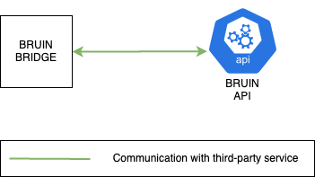

#### Digi-bridge microservice

This microservice is in charge of making requests to the Digi Reboot API, taking the role of replier in the context of NATS.

When another microservice asks to reboot a SD-WAN device, it will be in charge of making response messages to the same and never of request, that is to say, it will always be a producer within a NATS topic and never a consumer.

The following [diagram](https://app.diagrams.net/#G184B7YUYaKKWe5MsRKKY1rVVVQd_a1CbJ) shows the dependencies or interactions of this microservice with the others, being in this case none, since it is in charge of one of the isolated microservices as explained above.

#### Dri-bridge microservice

This microservice is in charge of replying to PIAB device data requests produced to NATS by integrating with the DRI API.

The following [diagram](https://app.diagrams.net/#G1j7g-Pze0MjRzuoUzDXpJhdi2yQXTZopM) shows the dependencies or interactions of this microservice with the others, being in this case none, since it is in charge of one of the isolated microservices as explained above.

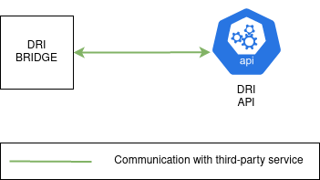

#### Email-tagger-kre-bridge microservice

This microservice is in charge of replying to email tag prediction requests produced to NATS by integrating with the Email Tagger's KRE.

The following [diagram](https://app.diagrams.net/#G1PLAtl9wesAhr9tEkukcZm-efcqbIv-bq) shows the dependencies or interactions of this microservice with the others, being in this case none, since it is in charge of one of the isolated microservices as explained above.

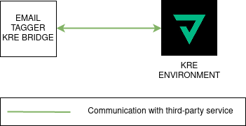

#### Hawkeye-bridge microservice

This microservice is in charge of making requests to the Hawkeye API, taking the role of replier in the context of NATS.

When another microservice requests Hawkeye data, it will be in charge of making response messages to the same and never of request, that is to say, it will always be a producer within a NATS topic and never a consumer.

The following [diagram](https://app.diagrams.net/#G1ki13-NoKadfUai12FWQCFebwkNGoKGFo) shows the dependencies or interactions of this microservice with the others, being in this case none, since it is in charge of one of the isolated microservices as explained above.

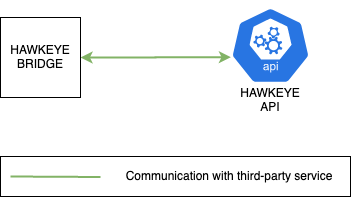

#### Notifier microservice

This microservice is in charge of sending emails, Slack notifications and SMS.

It is important to point out that it is not in charge of the composition of the messages to be sent, that is to say, of their content, but only of sending them.

The following [diagram](https://app.diagrams.net/#G19IZI0cCp1odvYIwgMGlrGiQfKYZbedx2) shows the dependencies or interactions of this microservice with the others, being in this case none, since it is in charge of one of the isolated microservices as explained above.

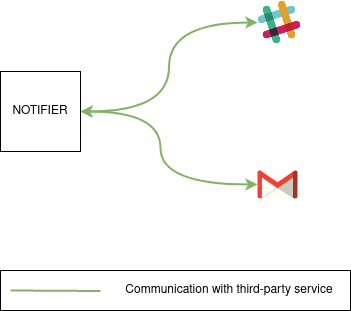

#### Repair-tickets-kre-bridge microservice

This microservice is in charge of replying to email tag prediction requests produced to NATS by integrating with the Email Tagger's KRE.

The following [diagram](https://app.diagrams.net/#G1Dx4LVqTeTPapfr_4_D_WAqqE4aGhM6Y3) shows the dependencies or interactions of this microservice with the others, being in this case none, since it is in charge of one of the isolated microservices as explained above.

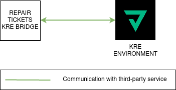

#### T7-bridge microservice

The function of this microservice is to embed in the notes of a ticket the prediction calculated by T7, this prediction will store information on the recommendations actions for the ticket.

In order to carry out the mentioned actions, it communicates with the API of T7 to obtain the information about the prediction, as it can be seen in the following [diagram](https://app.diagrams.net/#G18eBQnyAJwUxAAME2gKjxb9NCVbeCVzWt).

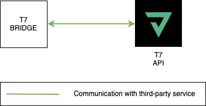

#### Velocloud-bridge microservice

This microservice is in charge of making requests to the velocloud API, taking the role of replier in the context of NATS.

When another microservice requests velocloud data, it will be in charge of making response messages to the same and never of request, that is to say, it will always be a producer within a NATS topic and never a consumer.

The following [diagram](https://app.diagrams.net/#G1bn-S0EvBXgnLW22Zwvdx4MJVx0hauXdQ) shows the dependencies or interactions of this microservice with the others, being in this case none, since it is in charge of one of the isolated microservices as explained above.

### Use cases microservices

#### Digi-reboot-report microservice

This microservice creates a report of the last 24 hours DiGi reboots by crossing DiGi recovery logs and Bruin ticket data and then emails it out.

The following [diagram](https://app.diagrams.net/#G1sAQA8REYxkX8Nfp_6Ol_0HqGIKiilGxA) shows the dependencies or interactions of this microservice with the others.

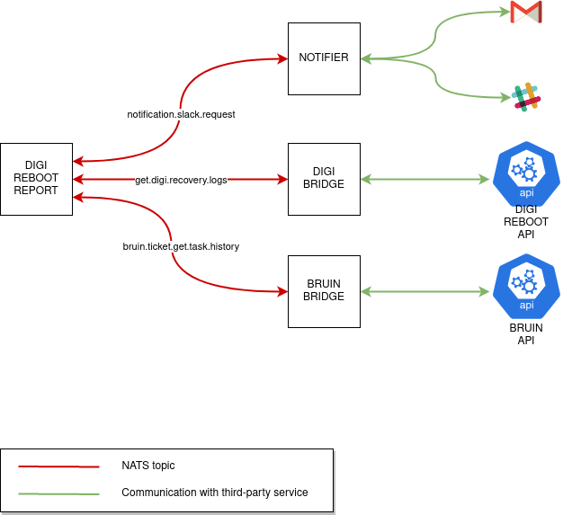

#### Email-tagger-monitor microservice

This microservice tags polled Bruin emails based on Email Tagger's KRE prediction.

The following [diagram](https://app.diagrams.net/#G16FwibBWRYseVvjMnbwxJHqingjM7QX_K) shows the dependencies or interactions of this microservice with the others.

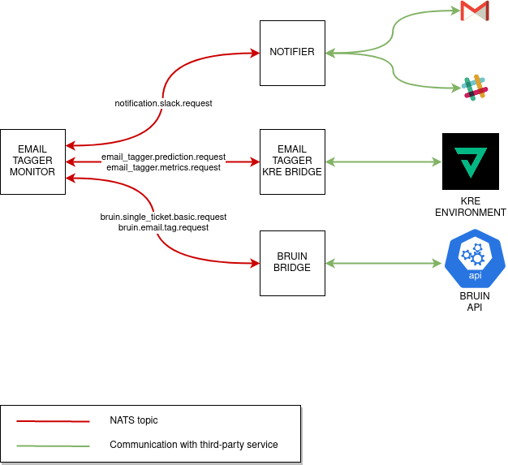

#### Fraud-monitor microservice

This microservice creates Bruin tickets based on unread fraud warning emails.

The following [diagram](https://app.diagrams.net/#G1S9vPf9bG1GJFu921goXiH93mOfn5Y6Ol) shows the dependencies or interactions of this microservice with the others.

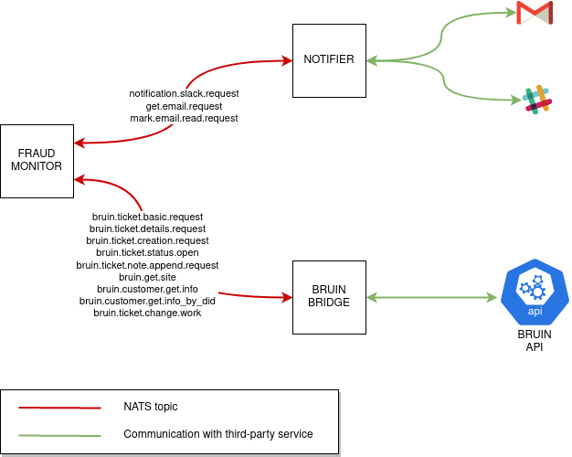

#### Grafana microservice

Although Grafana is a visualization tool for metrics, it needs to fetch some data from VeloCloud API to build dashboards for customer
Titan America.

The following [diagram](https://app.diagrams.net/#G1Q4GtTXtbDXUyJibl4bXF8ZKAaQMQlVrf) shows the dependencies or interactions of this microservice with the others.

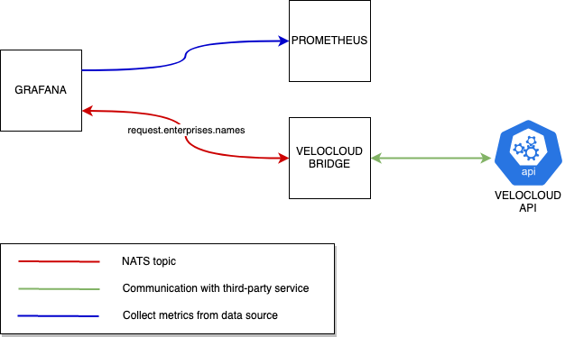

#### Hawkeye-affecting-monitor microservice

This service is responsible for creating, updating or resolving affecting tickets depending on Ixia devices test results.

In the following [diagram](https://app.diagrams.net/#G1uy-l4Y8amjx3PX9DikFjJiuNxwJSewoh) it's possible see the relationship of this microservice with the others.

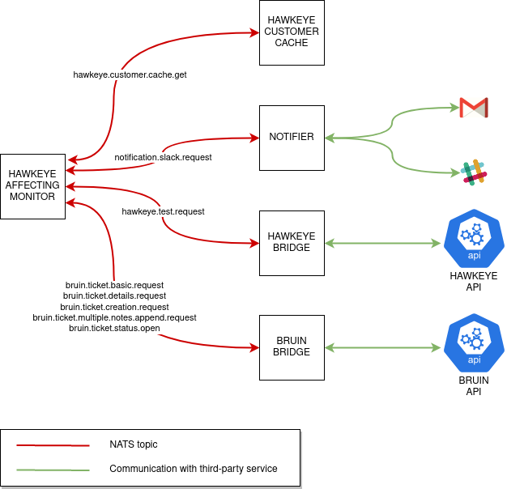

#### Hawkeye-outage-monitor microservice

This service is responsible for resolving/unresolving outage tickets depending on the state of a Hawkeye device. It is triggered every 3 minutes.

If a device is detected to be in outage state then it is scheduled for a recheck in the next 5 seconds. If the device is still in outage state, the system
will try creating a new outage ticket. If Bruin reports back that an outage ticket with Resolved status exists already then it is unresolved; if not, a new outage ticket may have been created or an outage ticket with In Progress status may exist already, so no additional action
will be taken.

In case the device was detected to be healthy, the system looks for an open outage ticket for this device and resolves it in case it exists.

In the following [diagram](https://app.diagrams.net/#G1ZAQSFthTrg4w2RGuzINR03LNlT54aOpZ) it's possible see the relationship of this microservice with the others.

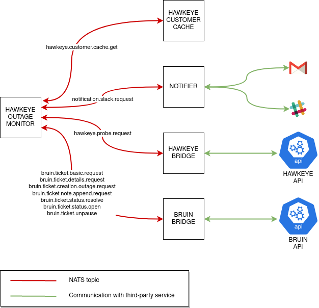

#### Intermapper-outage-monitor microservice

This service is responsible for creating and Service Outage tickets depending on the state of InterMapper devices. 
These are determined by parsing e-mails sent by MetTel's InterMapper instance to IPA's mailbox.

In the following [diagram](https://app.diagrams.net/#G1M055Rh3ErgeVtrTfjdK40ijF7ibyexbo) it's possible see the relationship of this microservice with the others.

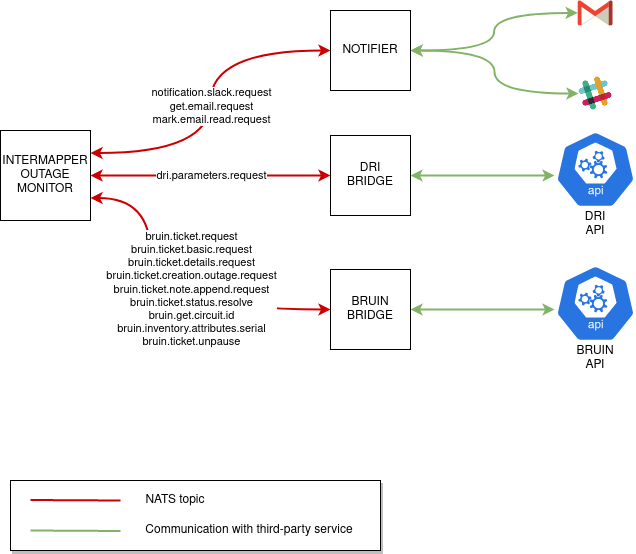

#### Last-contact-report microservice

The function to be performed by this microservice is to send a monthly report with information about routers that were last contacted more than 30 days ago.

The following flow is used to make this report:

1. The *last-contact-report* microservice communicates with the *velocloud-bridge* microservice to obtain events from an edge.

2. Once the events are obtained from an edge, it communicates with the *notifier* microservice to send an email with this information.

It is possible to see the relations between the mentioned services for the flow in the following [diagram](https://app.diagrams.net/#G13QWoYPfjPgxZ0Mp1Nl7SDZVonzUj2tIS).

#### Links-metrics-collector microservice

This service is responsible for collecting metrics time series for VeloCloud edges and storing them to a MongoDB instance.

The following [diagram](https://app.diagrams.net/#G1YeRvdfGBfRCJzlvVt_ts6qJ1s0MSgTlr) shows the dependencies or interactions of this microservice with the others.

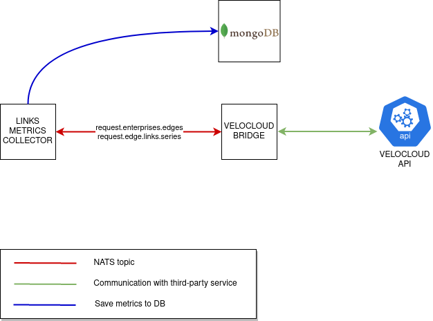

#### Repair-tickets-monitor microservice

This service is responsible for post processing e-mails tagged by the E-mail Tagger Monitor to create Service Outage tickets in Bruin, as long as the AI model living in the KRE instance dictates so through predictions.

The following [diagram](https://app.diagrams.net/#G1iwUTk1QGrLi2OKuKHpIB6K0KJ1s2W87e) shows the dependencies or interactions of this microservice with the others.

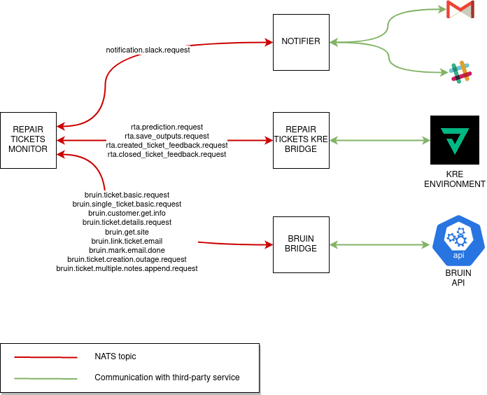

#### Service-affecting-monitor microservice

In this microservice are defined a series of scales and thresholds, the function of this will be to check if there is loss of packages, latencies or jitter measurements that exceed the thresholds defined.

In case the thresholds are exceeded, it will communicate with the notifier service to send a notification by email and slack, by means of which it will warn of the problems detected on a specific edge.

This microservice also communicates with the bruin-bridge microservice to create tickets or add notes to an existing one, including in this information about the routers for which a problem is detected.

In the following [diagram](https://app.diagrams.net/#G1iwUTk1QGrLi2OKuKHpIB6K0KJ1s2W87e) it's possible see the relationships between this microservice and the others.

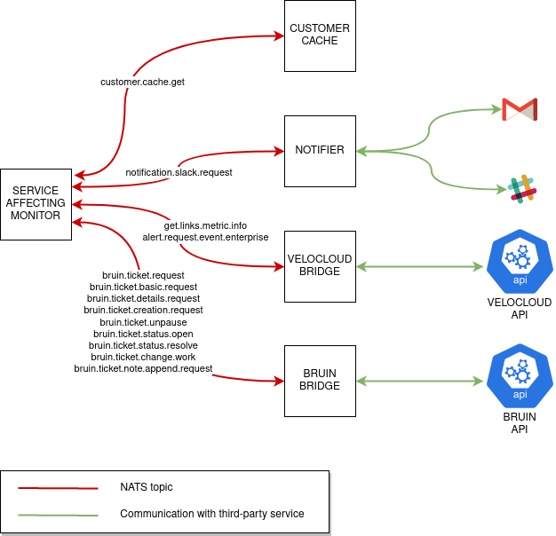

#### Service-outage-monitor microservice

This microservice orchestrates the execution of two different processes:

* Outage monitoring. This process is responsible for resolving/unresolving outage tickets depending on the state of an edge. It is triggered every 3 minutes.

  If an edge is detected to be in outage state then it is scheduled for a recheck in the next 5 seconds. If the edge is still in outage state, the system
will try creating a new outage ticket. If Bruin reports back that an outage ticket with Resolved status exists already then it is unresolved; if not, a new outage ticket may have been created or an outage ticket with In Progress status may exist already, so no additional action
will be taken.

  In case the edge was detected to be healthy, the system looks for an open outage ticket for this edge and resolves it in case it exists.

* Triage. This process is aimed at updating Bruin tickets with information related to recent edge events. It is triggered every 10 minutes.

  At the beginning, the process gathers all the open tickets related with the companies that are under triage monitoring. Tickets not related with edges belonging to these companies
  are discarded before going on.

  The process starts dealing with every ticket in the set collected in the previous step:
  * If the outage ticket does not have any triage note from a previous execution of the triage process then a triage note is appended with information of the events related to the edge corresponding to this ticket. Events correspond to the period between 7 days ago and the current moment.
    If the current environment is DEV instead of PRODUCTION then no note is appended to the ticket; instead, a notification with a summary of the triage results is delivered to a Slack channel.

  * If the outage ticket already has a triage note from a previous execution then the process attempts to append new triage notes to the ticket but only if the last triage note was not appended recently (30 minutes or less ago). In case there's no recent triage note, edge events from the period
    between the creation date of the last triage note and the current moment are claimed to Velocloud and then they are included in the triage notes, which are finally appended to the ticket. Note that due to Bruin limitations it is not feasible to have a triage note with 1500 characters or more;
    that is the reason why several triage notes are appended to the ticket (instead of just appending one).

In the following [diagram](https://app.diagrams.net/#G1-ESnlWgdP7-SbwhP3NAuRWv6ZMuSOUu0) it's possible see the relationship of this microservice with the others.

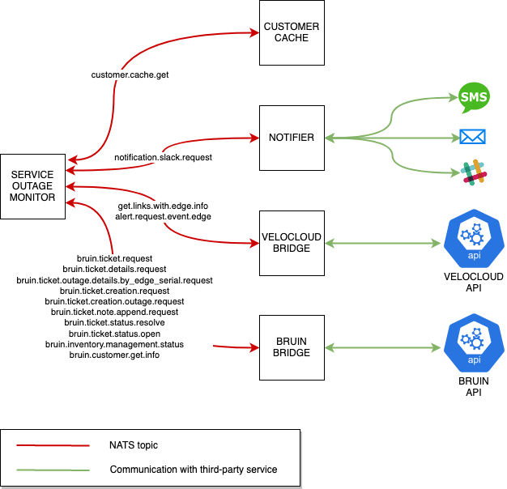

#### Sites-monitor microservice

This microservice requests data from the velocloud API via the velocloud-bridge microservice, using this information to enrich Prometheus. The prometheus data serves as a feed for Grafana.

The following [diagram](https://app.diagrams.net/#G1XwwdfpZZ5Wxn-0L-gt-fmlsysUqIhC_7) shows the relationship between this microservice and the others.

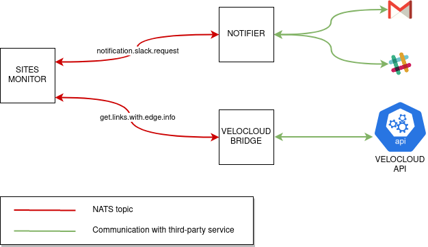

#### TNBA-feedback microservice

This microservice is in charge of collecting closed tickets that had a TNBA note appended by `tnba-monitor` at some point. After collecting them, they are sent to `t7-bridge` to retrain predictive models and hence improve
the accuracy of predictions claimed by `tnba-monitor`.

The following [diagram](https://app.diagrams.net/#G1Gwr3JseMInuIsKIB1CQOU9TEABipepfq) shows the relationship between this microservice and the others.

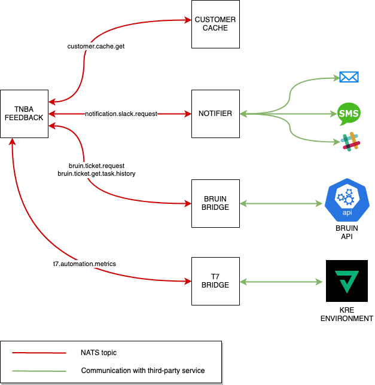

#### TNBA-monitor microservice

This microservice is in charge of appending notes to Bruin tickets indicating what is *T*he *N*ext *B*est *A*ction a member of the support team of
Bruin can take to move forward on the resolution of the ticket.

It mostly communicates with `bruin-bridge` and `t7-bridge` to embed predictions into tickets, but it also communicates with other capabilities as shown in the following [diagram](https://www.draw.io/#G1uD7Otczhg_kZrgtBztJ5GvLkud0uaTNv).

The following [diagram](https://app.diagrams.net/#G1sNibE62BOYWLQr0asl7YC4-15lBxrAA0) shows the relationship between this microservice and the others.

### Special microservices (NATS Requester and Replier)

#### Customer-cache microservice

This microservice is in charge of crossing Bruin and Velocloud data. More specifically, it focus on associating Bruin customers with Velocloud edges.
On the other hand, it also serves this information to the rest of services.

This service is a special one, since it acts as a requester (to build and store caches) but also as a replier (to serve caches to services requesting them).

The following [diagram](https://app.diagrams.net/#G1y-I8UCvNxvZo538T9BEY0mfteGi52Pzk) shows the dependencies or interactions of this microservice with the rest.

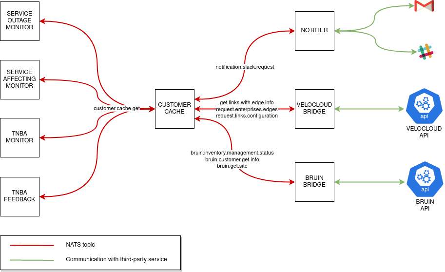

From the point of view of services to the left of `customer-cache`, it plays the role of a replier as it answers to requests sent by them.

From the point of view of services to the right of `customer-cache`, it plays the role of a requester as it asks for data to Velocloud and Bruin to cross it.

#### Hawkeye-customer-cache microservice

This microservice is in charge of crossing Bruin and Hawkeye data. More specifically, it focus on associating Bruin customers with Hawkeye devices.
On the other hand, it also serves this information to the rest of services.

This service is a special one, since it acts as a requester (to build and store caches) but also as a replier (to serve caches to services requesting them).

The following [diagram](https://app.diagrams.net/#G1QLpox45cZE4PV3dxlZsnK5Gv1N6hQNvM) shows the dependencies or interactions of this microservice with the rest.

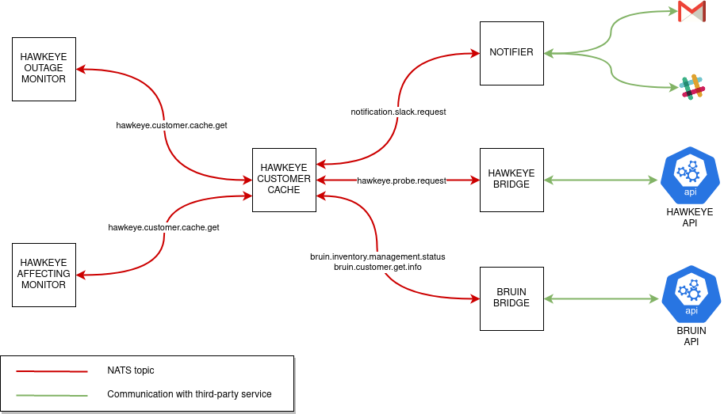

From the point of view of services to the left of `hawkeye-customer-cache`, it plays the role of a replier as it answers to requests sent by them.

From the point of view of services to the right of `hawkeye-customer-cache`, it plays the role of a requester as it asks for data to Hawkeye and Bruin to cross it.

### Microservices that don't communicate with NATS

#### Links-metrics-api

This service is responsible for exposing a REST API to query the time series that are stored in the MongoDB instance.

This service is self-contained, i.e. it does not require access to NATS or Redis or any other microservice within the Automation Engine.

The following [diagram](https://app.diagrams.net/#G1yIeNn6kGMEyX24rHgWsJDV9-I4n86nxl) shows the dependencies or interactions of this microservice with the rest.

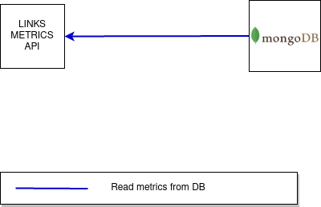

#### lumin-billing-report

This service automates requesting billing information for a given customer from the Lumin.AI service provider, generating a summary HTML email and attaching a csv with all data for the current billing period.

This service is self-contained, i.e., it does not require access to NATS or Redis, or any other microservice within the Automation Engine.

The following [diagram](https://app.diagrams.net/#G1kdUzFnFiu_u1c5SltBs6MSeXr2nqQgFw) shows the relationship between this service and the third-party services it uses.

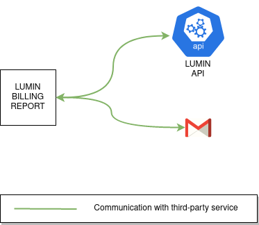

#### Prometheus & Thanos

The purpose of Prometheus is to scrape metrics from HTTP servers placed in those services with the ability to write metrics, nothing else.

Thanos is just another component that adds a layer of persistence to Prometheus, thus allowing to save metrics before they are lost when a service is re-deployed. These metrics
can be restored after the deployment completes.

Metrics are usually displayed in a Grafana instance with a few custom dashboards.

The following [diagram](https://app.diagrams.net/#G15dB_8RisA3p0HWtdsFr-5--iUAj1_Y34) shows the relationship between Prometheus, the metrics servers it scrapes metrics, and Grafana.

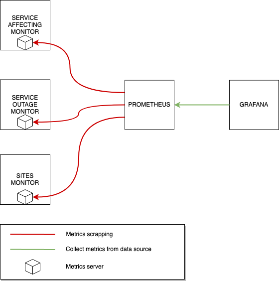

#### Ticket-collector

This service is responsible for collecting and storing information of Bruin tickets to a MongoDB instance.

Although the service clearly uses Bruin to fetch data, this service is self-contained, i.e., it does not require access to NATS or Redis, or any other microservice within the Automation Engine, which essentially means it does not use bruin-bridge. For that reason, it is not a REQuester or a REPlier.

The following [diagram](https://app.diagrams.net/#G1HqP3HfIBZ-iJkmKV8dRoXilgmEhHtDwb) shows the dependencies or interactions of this microservice with the rest.

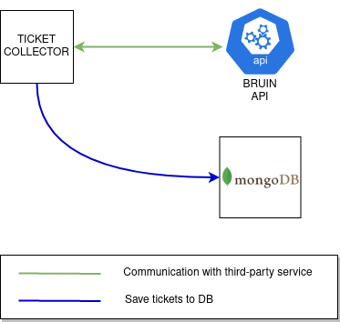

#### Ticket-statistics

This service is responsible for calculating ticket statistics, store them, and expose them through an API.
These statistics are used to build some custom Grafana dashboards.

Although the service clearly uses Bruin to fetch data, this service is self-contained, i.e., it does not require access to NATS or Redis, or any other microservice within the Automation Engine, which essentially means it does not use bruin-bridge. For that reason, it is not a REQuester or a REPlier.

The following [diagram](https://app.diagrams.net/#G1wMDs-vmY_avG6rj9VBsJGA_BkWvsi1Nm) shows the dependencies or interactions of this microservice with the rest.

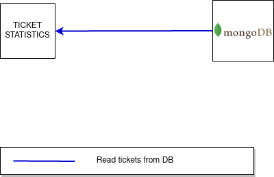

#### Redis

Redis is an in-memory key-value store that, in this system, is used mostly for caching purposes, and also as a temporary storage for
messages larger than 1 MB, which NATS cannot handle by itself.

There are three Redis instances:
* **redis**. Used to store NATS messages larger than 1 MB temporarily. All microservices that communicate with NATS in some way have the
ability to store and retrieve messages from this Redis instance.

* **redis-customer-cache**. Used to turn `customer-cache` and `hawkeye-customer-cache` into fault-tolerant services, so if any of them
fail caches will still be available to serve as soon as they come back.

* **redis-tnba-feedback**. Used to collect huge amounts of Bruin tickets' task histories before they are sent to T7 by the `tnba-feedback` service.

## Technologies and tools

### Code repository

- [Intelygenz's Gitlab](https://gitlab.intelygenz.com/) is used to store the project's code

- [Gitlab CI](https://docs.gitlab.com/ee/ci/) is used as the CI/CD tool for the project

### Containerization

The following containerization tools are used:

- [Docker](https://docs.docker.com/) is used to create o container of this type by microservice
    > In the folder of each microservice there is a `Dockerfile` that allows to execute that microservice as a container

- [Docker-compose](https://docs.docker.com/compose/) is used for defining and running project microservices as a multi-container Docker application:
    > At the root of the repository there is a `docker-compose.yml` file that allows to run one or more microservices as docker containers

## Infrastructure

### Microservices Infrastructure

For the microservices ECS is used to deploy a container for each microservice for all [environments](PIPELINES.md#microservices-environments) deployed, as each one has its own repository in the ECR registry used in the project.

In the following [diagram](https://www.draw.io/#G1eET1FDYMJ7bf2xpZVXfEaEnz1DA-V6M2) it's possible see how the microservices of the project are deployed, using the different images available in the registry created for the project in ECR.

### KRE Infrastructure

In this project [KRE](https://konstellation-io.github.io/website/) is used, it has been deployed in an [Kubernetes](https://kubernetes.io/docs/home/) cluster using [EKS](https://docs.aws.amazon.com/eks/latest/userguide/what-is-eks.html) for each of the necessary [environments](PIPELINES.md#KRE-Environments), as well as all the parts needed for this in AWS.

In the following [diagram](https://app.diagrams.net/#G1Mcg9-Z0AOkA_R8juMD6UuQQGIJX57b2f) it's possible see how is configured the KRE infrastructure in the project.

### Network infrastructure

For the infrastructure of the network resources there is a distinction according to the [microservice environments](PIPELINES.md#microservices-environments) and also the [kre-environmetns](PIPELINES.md#kre-environments) to deploy belongs to `dev` or `production`.

In the following [diagram](https://www.draw.io/#G1s8eD7_XNplcVC6b-Aqtjd1p_Vf2quPnn) it's possible see the infrastructure relative to the existing network resources in AWS created for the two type of environments.

When deploying an environment it will use the resources belonging to the environment type. This approach has been implemented so that regardless of the number of ECS clusters being used, the same public IPs are always used to make requests outward from the different environments. KRE's clusters will also use the VPCs corresponding to each environment, i.e., `dev` or `production`.

---
With passion from the [Intelygenz](https://www.intelygenz.com) Team @ 2020