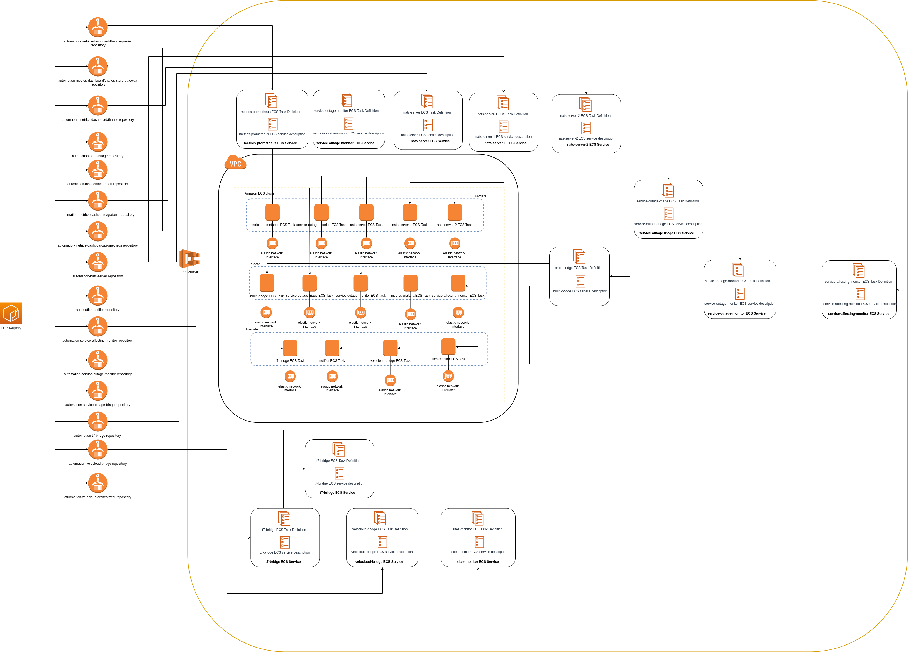

# System overview

## System architecture

It is a project based on microservices, in which two types are distinguished:

* **Capabilities**: They are in charge of carrying out certain common actions for the business logic.

  For example: Collect information from SD-WAN routers.
  
* **Use cases**: They use the capabilities as a base to make specific use cases.

  For example: Obtain certain tickets from SD-WAN routers of a company, obtaining the information from the routers for subsequent storage in the corresponding tickets.

It is important to emphasize on the architecture of the system the use of [NATS](https://github.com/nats-io/nats-server) in it.

> NATS is a simple, secure and performant communications system for digital systems, services and devices. NATS is part of the Cloud Native Computing Foundation (CNCF). NATS has over 30 client language implementations, and its server can run on-premise, in the cloud, at the edge, and even on a Raspberry Pi. NATS can secure and simplify design and operation of modern distributed systems. [NATS Github repository](https://github.com/nats-io/nats-server)

NATS is used in the microservice system as a communication center for all of them. It is used in cluster mode to satisfy more work to be done by it.

In the following [diagram](https://www.draw.io/#G1zd4zHYf7B0iTxBUmXxq9qK-Tap4zH5vh) it's possible see a graph with the representation of the different microservices and modules that are part of the project architecture.

There are two types of microservices showed in the diagram above depending on the connection between them and NATS:

* Microservices that communicate with NATS, divided into two types

  * Those that take the role of replier in the context of NATS, these are the microservices that contain capabilites, being these the following ones:

    * *notifier*

    * *velocloud-bridge*

    * *bruin-bridge*

    * *t7-bridge*

  * Those that take the role of requester in the context of NATS, these are microservices that contain use cases, being these the following ones:

    * *service-affecting-monitor*

    * *service-outage-monitor*

    * *service-outage-triage*

    * *sites-monitor*

    * *last-contact-report*

* Microservices that doesn't communicate with NATS
  
  * *metrics-grafana*

  * *metrics-prometheus*

  * *Redis cluster* (Docker container in local/ElastiCache Redis Cluster in AWS)

### Connection between microservices

The services that are part of the previously explained architecture are related to each other, in the following [diagram](https://www.draw.io/#G1KbDy9gSMOmwVC0fWnqmeHxupclXEfYl_) it's possible see the relationships between them.

#### Bruin-bridge microservice

This microservice is in charge of making requests to the bruin API, taking the role of replier in the context of NATS.

When another microservice requests bruin data, it will be in charge of making response messages to the same and never of request, that is to say, it will always be a producer within a NATS topic and never a consumer.

The following [diagram](https://www.draw.io/#G1_NissfciInkExqxBCI2wTafnjyyelHhz) shows the dependencies or iteractions of this microservice with the others, being in this case none, since it is in charge of one of the isolated microservices as explained above.

#### Notifier microservice

This microservice is in charge of sending emails or slack notifications.

It is important to point out that it is not in charge of the composition of the messages to be sent, that is to say, of their content, but only of sending them.

The following [diagram](https://www.draw.io/#G1pbs-QPdcn8E0z4nteNR66TXiBQqTDwcQ) shows the dependencies or iteractions of this microservice with the others, being in this case none, since it is in charge of one of the isolated microservices as explained above.

#### Velocloud-bridge microservice

This microservice is in charge of making requests to the velocloud API, taking the role of replier in the context of NATS.

When another microservice requests velocloud data, it will be in charge of making response messages to the same and never of request, that is to say, it will always be a producer within a NATS topic and never a consumer.

The following [diagram](https://www.draw.io/#G1bN_ZIbL1LDPyJ5cVKUlg4tOsEnCVqXDt) shows the dependencies or iteractions of this microservice with the others, being in this case none, since it is in charge of one of the isolated microservices as explained above.

#### Last-contact-report microservice

The function to be performed by this microservice is to send a monthly report with information about routers that were last contacted more than 30 days ago.

The following flow is used to make this report:

1. The *last-contact-report* microservice communicates with the *velocloud-bridge* microservice to obtain events from an edge.

2. Once the events are obtained from an edge, it communicates with the *notifier* microservice to send an email with this information.

It is possible to see the relations between the mentioned services for the flow in the following [diagram](https://www.draw.io/#G1JzSwJw04goDcA_fEjySmMZ_Ol32TVSeB).

#### Sites monitor microservice

This microservice requests data from the velocloud API via the velocloud-bridge microservice, using this information to enrich Prometheus. The prometheus data serves as a feed for Grafana.

The following [diagram](https://www.draw.io/#G1xmdDJALLoK25VmO7-gSVITODfaTFIyT_) shows the relationship between this microservice and the others.

#### T7-bridge microservice

The function of this microservice is to embed in the notes of a ticket the prediction calculated by T7, this prediction will store information on the recommendations actions for the ticket.

In order to carry out the mentioned actions, it communicates with the API of T7 to obtain the information about the prediction, as it can be seen in the following [diagram](https://www.draw.io/#G1uD7Otczhg_kZrgtBztJ5GvLkud0uaTNv).

> **It is important to note that this microservice is not currently used.**

#### Service-affecting-monitor microservice

In this microservice are defined a series of scales and thresholds, the function of this will be to check if there is loss of packages or latencies that exceed the thresholds defined.

In case the thresholds are exceeded, it will communicate with the notifier service to send a notification by email and slack, by means of which it will warn of the problems detected on a specific edge.

This microservice also communicates with the bruin-bridge microservice to create tickets or add notes to an existing one, including in this information about the routers for which a problem is detected.

In the following [diagram](https://www.draw.io/#G1FE_V_fGLC9wSsa9wWMixDMnG_7EGGOxJ) it's possible see the relationships between this microservice and the others.

#### Service-outage-triage microservice

The objective of this microservice is to enrich information from a ticket, adding to this edge alerts obtained through the *velocloud-bridge* microservice. It is important to note that this microservice will never create tickets.

For this ticket enrichment process, events are obtained from a router, creating a triage note and adding it to a ticket associated with that router. The events observed correspond to those of the last seven days.

This microservice also sends notifications by email and slack, when the mentioned information is added to the ticket, using the *notifier* microservice.

In the following [diagram](https://www.draw.io/#G1sng_-HPOWgPHWry2uFcHXoVfbEw-3ihN) it's possible see the relations of this microservice with the others.

#### Service-outage-monitor microservice

The function performed by this microservice is to obtain the edges of certain clients, observing these for the detection of falls (outages).

When a fall of a router is detected, it is kept in a "quarantine" to observe it more closely. If, after a while, the edge continues to fall, then a query is made as to whether it has a ticket created, and if it does not, it is moved from quarantine to a reporting queue.

Every hour the reporting queue is consumed and an e-mail is sent, this will include all the routers that at some point have fallen without any support ticket created, using the notifier microservice.

In the following [diagram](https://www.draw.io/#G1Da5yU-ohkQQ5eKJE1sB9URzLyXyXcZx0) it's possible see the relationship of this microservice with the others.

## Infrastructure

### Environment infrastructure

MetTel Automation uses ECS to deploy a container for each microservice for all [environments](PIPELINES.md#environments) deployed, as each one has its own repository in the ECR registry used in the project.

In the following [diagram](https://www.draw.io/#G1eET1FDYMJ7bf2xpZVXfEaEnz1DA-V6M2) it's possible see how the microservices of the project are deployed, using the different images available in the registry created for the project in ECR.

### Network infrastructure

For the infrastructure of the network resources there is a distinction according to the [environment](PIPELINES.md#environments) to deploy belongs to dev or production.

In the following [diagram](https://www.draw.io/#G1s8eD7_XNplcVC6b-Aqtjd1p_Vf2quPnn) it's possible see the infrastructure relative to the existing network resources in AWS created for the two type of environments.

When deploying an environment it will use the resources belonging to the environment type. This approach has been implemented so that regardless of the number of ECS clusters being used, the same public IPs are always used to make requests outward from the different environments.

---
With passion from the [Intelygenz](https://www.intelygenz.com) Team @ 2019