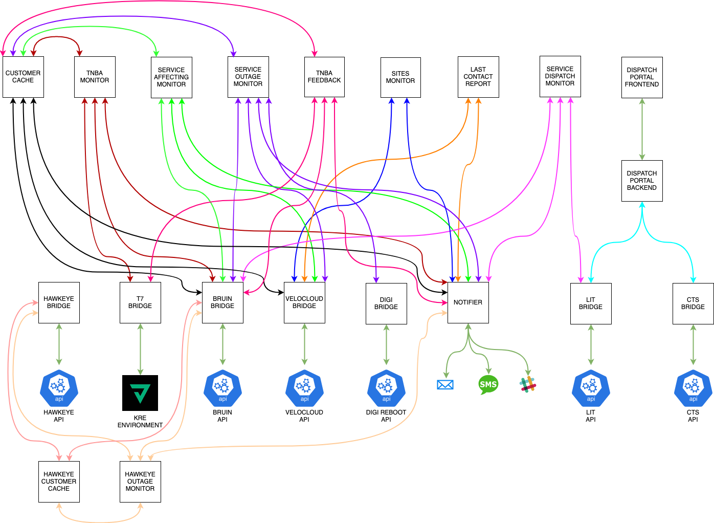

# System overview

## System architecture

It is a project based on microservices, in which two types are distinguished:

* **Capabilities**: They are in charge of carrying out certain common actions for the business logic.

  For example: Collect information from SD-WAN routers.
  
* **Use cases**: They use the capabilities as a base to make specific use cases.

  For example: Obtain certain tickets from SD-WAN routers of a company, obtaining the information from the routers for subsequent storage in the corresponding tickets.

It is important to emphasize on the architecture of the system the use of [NATS](https://github.com/nats-io/nats-server) in it.

> NATS is a simple, secure and performant communications system for digital systems, services and devices. NATS is part of the Cloud Native Computing Foundation (CNCF). NATS has over 30 client language implementations, and its server can run on-premise, in the cloud, at the edge, and even on a Raspberry Pi. NATS can secure and simplify design and operation of modern distributed systems. [NATS Github repository](https://github.com/nats-io/nats-server)

NATS is used in the microservice system as a communication center for all of them. It is used in cluster mode to satisfy more work to be done by it.

In the following [diagram](https://www.draw.io/#G1zd4zHYf7B0iTxBUmXxq9qK-Tap4zH5vh) it's possible see a graph with the representation of the different microservices and modules that are part of the project architecture.

There are two types of microservices showed in the diagram above depending on the connection between them and NATS:

* Microservices that communicate with NATS, divided into two types

  * Those that take the role of replier in the context of NATS, these are the microservices that contain capabilites, being these the following ones:

    * *cts-bridge*

    * *lit-bridge*

    * *notifier*

    * *velocloud-bridge*

    * *bruin-bridge*

    * *t7-bridge*

  * Those that take the role of requester in the context of NATS, these are microservices that contain use cases, being these the following ones:

    * *dispatch-portal-backend*

    * *grafana* component, from *metrics-prometheus* microservice

    * *last-contact-report*

    * *service-affecting-monitor*
    
    * *service-dispatch-monitor*

    * *service-outage-monitor*

    * *sites-monitor*

    * *tnba-monitor*

  > All microservices that communicate with NATS can also communicate with the Redis cluster. This is needed
  to bypass the limit size that NATS enforces for all the messages it receives (1MB).

* Microservices that doesn't communicate with NATS

  * *dispatch-portal-frontend*
  
  * *lumin-billing-report*

  * *prometheus* and *thanos* components, from *metrics-prometheus* microservice

  * *Redis cluster* (Docker container in local/ElastiCache Redis Cluster in AWS)

### Connection between microservices

The services that are part of the previously explained architecture are related to each other, in the following [diagram](https://www.draw.io/#G1npbFKJq-cODHY5WddFt4aB-d3y9bv_lW) it's possible see the relationships between them.

#### Bruin-bridge microservice

This microservice is in charge of making requests to the bruin API, taking the role of replier in the context of NATS.

When another microservice requests bruin data, it will be in charge of making response messages to the same and never of request, that is to say, it will always be a producer within a NATS topic and never a consumer.

The following [diagram](https://www.draw.io/#G1hm9zTW5i2ATZGzxu6rpSlU_q58eas4Er) shows the dependencies or iteractions of this microservice with the others, being in this case none, since it is in charge of one of the isolated microservices as explained above.

#### Notifier microservice

This microservice is in charge of sending emails, Slack notifications and SMS.

It is important to point out that it is not in charge of the composition of the messages to be sent, that is to say, of their content, but only of sending them.

The following [diagram](https://www.draw.io/#G1pbs-G1PYWiomIPqlX98oyuaYGkYgR30k4rumZU) shows the dependencies or iteractions of this microservice with the others, being in this case none, since it is in charge of one of the isolated microservices as explained above.

#### Velocloud-bridge microservice

This microservice is in charge of making requests to the velocloud API, taking the role of replier in the context of NATS.

When another microservice requests velocloud data, it will be in charge of making response messages to the same and never of request, that is to say, it will always be a producer within a NATS topic and never a consumer.

The following [diagram](https://www.draw.io/#G18Yl-0CTx_AZefmkxo_HN3PPq85cu3FlR) shows the dependencies or iteractions of this microservice with the others, being in this case none, since it is in charge of one of the isolated microservices as explained above.

#### Last-contact-report microservice

The function to be performed by this microservice is to send a monthly report with information about routers that were last contacted more than 30 days ago.

The following flow is used to make this report:

1. The *last-contact-report* microservice communicates with the *velocloud-bridge* microservice to obtain events from an edge.

2. Once the events are obtained from an edge, it communicates with the *notifier* microservice to send an email with this information.

It is possible to see the relations between the mentioned services for the flow in the following [diagram](https://www.draw.io/#G1MrpWIRpw4wHeSRo6TCe6IOUZahsHoH6H).

#### Service-affecting-monitor microservice

In this microservice are defined a series of scales and thresholds, the function of this will be to check if there is loss of packages or latencies that exceed the thresholds defined.

In case the thresholds are exceeded, it will communicate with the notifier service to send a notification by email and slack, by means of which it will warn of the problems detected on a specific edge.

This microservice also communicates with the bruin-bridge microservice to create tickets or add notes to an existing one, including in this information about the routers for which a problem is detected.

In the following [diagram](https://www.draw.io/#G1TJksbMyHCN-wStHoQQw6wG95oKN2nbx6) it's possible see the relationships between this microservice and the others.

#### Service-dispatch-monitor microservice

This microservice monitor dispatches statuses for different vendors, at the time of writting this document LIT and CTS. Both processes are pretty much the same in concept but with differences in the implementation.

A dispatch is general terms can have the following statuses:

- Requested
- Confirmed
- Tech on site
- Canceled
- Completed

The main use is to monitor:

- Dispatch status changed
- Updates in the dispatch like the technician
- Send sms prior 2 and 12 hours before
- Send sms tech on site
- Cancel dispatch

The basic algorithm behaves like this:

- Get all dispatches for a vendor
- Filter dispatches that are created through the `dispatch-portal`
- Discard invalid ticket ids or dispatches with not proper fields
- Split the dispatches by status and then send them to the function to proccess them, there are 3 general functions
    * Confirmed dispatch:
        - Send sms and append note to bruin when a dispatch is confirmed
        - Send sms and append note to bruin 12 or 2 hours prior the dispatch
        - Send sms and append note to bruin when a tech has changed
    * Tech on site dispatch:
        - Send sms and append note to bruin when tech on site
    * Canceled dispatch:
        - Append note to bruin when a dispatch is canceled

Each vendor has it's own details like how to retrieve some fields or how we identify the tickets with the dispatches, all explained in the `service-dispatch-monitor`.

In the following [diagram](https://www.draw.io/#G1BH1c57HfqXE-jn5BVtgU3j5b8CILgC3V) it's possible see the relationships between this microservice and the others.

#### Service-outage-monitor microservice

This microservice orchestrates the execution of three different processes:

* Comparison report. This process is in charge of reporting edges in outage state that are not under an outage ticket every hour.

  When an outage is detected, the edge is sent to a quarantine and it is checked again 10 minutes later. If the edge remains in outage state and it
is not under any outage ticket in Bruin then it is moved from quarantine to another queue to be reported. The report is sent via e-mail when the hour scheduled at the beginning of the process is reached.

  > This feature exists in code but it is currently disabled.

* Outage monitoring. This process is responsible for resolving/unresolving outage tickets depending on the state of an edge. It is triggered every 3 minutes.

  If an edge is detected to be in outage state then it is scheduled for a recheck in the next 10 minutes. If the edge is still in outage state, the system
will try creating a new outage ticket. If Bruin reports back that an outage ticket with Resolved status exists already then it is unresolved; if not, a new outage ticket may have been created or an outage ticket with In Progress status may exist already, so no additional action
will be taken.

  In case the edge was detected to be healthy, the system looks for an open outage ticket for this edge and resolves it in case it exists.

* Triage. This process is aimed at updating existing outage tickets in Bruin with information related to recent edge events. It is triggered every 2 minutes.

  At the beginning, the process gathers all the open outage tickets related with the companies that are under triage monitoring. Tickets not related with edges belonging to these companies
  are discarded before going on.

  The process starts dealing with every ticket in the set collected in the previous step:
  * If the outage ticket does not have any triage note from a previous execution of the triage process then a triage note is appended with information of the events related to the edge corresponding to this ticket. Events correspond to the period between 7 days ago and the current moment.
    If the current environment is DEV instead of PRODUCTION then no note is appended to the ticket; instead, an e-mail with a summary of the triage results is delivered to the development team.

  * If the outage ticket already has a triage note from a previous execution then the process attempts to append new triage notes to the ticket but only if the last triage note was not appended recently (30 minutes or less ago). In case there's no recent triage note, edge events from the period
    between the creation date of the last triage note and the current moment are claimed to Velocloud and then they are included in the triage notes, which are finally appended to the ticket. Note that due to Bruin limitations it is not feasible to have a triage note with 1500 characters or more;
    that is the reason why several triage notes are appended to the ticket (instead of just appending one).

In the following [diagram](https://www.draw.io/#G11LUSJtUUGETqQSEJzW7ewmJmw0HmpW5f) it's possible see the relationship of this microservice with the others.

#### Sites-monitor microservice

This microservice requests data from the velocloud API via the velocloud-bridge microservice, using this information to enrich Prometheus. The prometheus data serves as a feed for Grafana.

The following [diagram](https://www.draw.io/#G10QYwr2V_WS0kjfxdhFomYiTNSdXL9x2u) shows the relationship between this microservice and the others.

#### T7-bridge microservice

The function of this microservice is to embed in the notes of a ticket the prediction calculated by T7, this prediction will store information on the recommendations actions for the ticket.

In order to carry out the mentioned actions, it communicates with the API of T7 to obtain the information about the prediction, as it can be seen in the following [diagram](https://www.draw.io/#G162Jq0mZDiHHVsIgQts0TUnNizTER4cT0).

#### TNBA-monitor microservice

This microservice is in charge of appending notes to Bruin tickets indicating what is *T*he *N*ext *B*est *A*ction a member of the support team of
Bruin can take to move forward on the resolution of the ticket.

It mostly communicates with `bruin-bridge` and `t7-bridge` to embed predictions into tickets, but it also communicates with other capabilities as shown in the following [diagram](https://www.draw.io/#G1uD7Otczhg_kZrgtBztJ5GvLkud0uaTNv).

The following [diagram](https://www.draw.io/#G1Yu4rtLV6WvOWr7FxE1l-sclOL4SA5r2z) shows the relationship between this microservice and the others.

## Infrastructure

### Microservices Infrastructure

For the microservices ECS is used to deploy a container for each microservice for all [environments](PIPELINES.md#microservices-environments) deployed, as each one has its own repository in the ECR registry used in the project.

In the following [diagram](https://www.draw.io/#G1eET1FDYMJ7bf2xpZVXfEaEnz1DA-V6M2) it's possible see how the microservices of the project are deployed, using the different images available in the registry created for the project in ECR.

### KRE Infrastructure

In this project [KRE](https://konstellation-io.github.io/website/) is used, it has been deployed in an [Kubernetes](https://kubernetes.io/docs/home/) cluster using [EKS](https://docs.aws.amazon.com/eks/latest/userguide/what-is-eks.html) for each of the necessary [environments](PIPELINES.md#KRE-Environments), as well as all the parts needed for this in AWS.

In the following [diagram](https://app.diagrams.net/#G1Mcg9-Z0AOkA_R8juMD6UuQQGIJX57b2f) it's possible see how is configured the KRE infrastructure in the project.

### Network infrastructure

For the infrastructure of the network resources there is a distinction according to the [microservice environments](PIPELINES.md#microservices-environments) and also the [kre-environmetns](PIPELINES.md#kre-environments) to deploy belongs to `dev` or `production`.

In the following [diagram](https://www.draw.io/#G1s8eD7_XNplcVC6b-Aqtjd1p_Vf2quPnn) it's possible see the infrastructure relative to the existing network resources in AWS created for the two type of environments.

When deploying an environment it will use the resources belonging to the environment type. This approach has been implemented so that regardless of the number of ECS clusters being used, the same public IPs are always used to make requests outward from the different environments. KRE's clusters will also use the VPCs corresponding to each environment, i.e., `dev` or `production`.

---
With passion from the [Intelygenz](https://www.intelygenz.com) Team @ 2020