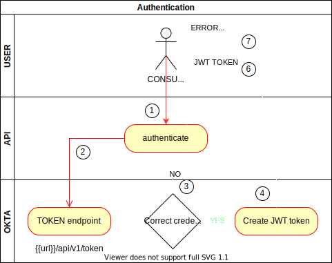

## Flow Diagram

Requisites
----------
- Okta account/user set up
- AWS login endpoint exposed to internet (Also whitelisted IP?)
- create a user on okta that has permisions to check the user and the token 
Description
-----------
As a requirement we need to accomplish centralized users and groups in Okta. We must connect Okta with our 
authentication workflow.

Flow
----
1. User will launch a signin call to our API endpoint
2. Our API endpoint will call to the auth enpoint of okta.
3. 

create api token
https://developer.okta.com/docs/guides/create-an-api-token/main/

https://developer.okta.com/docs/guides/create-an-api-token/main/

login with api token
https://developer.okta.com/docs/reference/api/authn/#response-example-for-primary-authentication-with-public-application-factor-enroll

token expiration
https://developer.okta.com/docs/guides/create-an-api-token/main/

validate access token
https://developer.okta.com/docs/guides/validate-access-tokens/python/main/

https://developer.okta.com/docs/guides/implement-grant-type/ropassword/main/#set-up-your-app