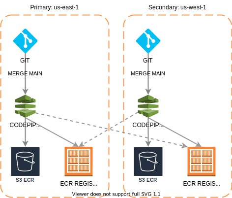

## Pre requisites
- [AWS user credentials](https://docs.aws.amazon.com/cli/latest/userguide/cli-configure-quickstart.html)
- [AWS ECR CLI](https://docs.aws.amazon.com/AmazonECR/latest/userguide/getting-started-cli.html)
- [UNZIP tool](https://speedysense.com/zip-and-unzip-command-in-ubuntu-terminal/)
## Description
The project at this moment is deployed in AWS infrastructure with all [FEDRAMP](https://www.fedramp.gov/)
requirements meet. To acompish this requirements the ECR repository must have a backup plan in case of losing the containers.

## Backup Plan
When the pipeline runs, the projects copy the docker containers from the comercial environment with the keys to validate that the images are delived 
by the intelygenz team. The Pipeline will push the containers to the 3 regions(Primary, Secundary and Terciary) and create a ZIP file with the next
format <service_name>/<date>-<service_version>-<global_version>.tar. The s3 bucket name that contains the containers is "fedramp-ecr-backups"

## Recovery Plan
Before start, you must be loged on the AWS docker login.

To recovery a ECR container in case is lost/deleted follow the next steps:
- Identify the Activated region and go to s3 and find "fedramp-ecr-backups" bucket.
- Download the file <service_name>/<date>-<service_version>-<global_version>.tar of the version needed.
- Execute the next commands to recover the selected container of the <service_name>:
    - docker image load -i <date>-<service_version>-<global_version>.tar
    - docker image tag <registry_url>/<service_name>:<service_version>
    - docker push <registry_url>/<service_name>:<service_version>

## Test the recovery 
To test the recovery plan go to the ECR Repository <service_name> on the AWS UI and check if the version of the container exists.