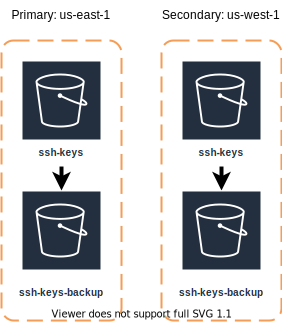

## Pre requisites
- [AWS user credentials](https://docs.aws.amazon.com/cli/latest/userguide/cli-configure-quickstart.html)
- [AWS SSH keys credentials](https://docs.aws.amazon.com/codecommit/latest/userguide/setting-up-ssh-unixes.html)

## Description
The project at this moment is deployed in AWS infrastructure with all [FEDRAMP](https://www.fedramp.gov/)
requirements meet. To acompish this requirements the SSH keys generated to access the EKS cluster need a backup plan and a recovery plan.

## Backup Plan
Each region generate the SSH keys crendentials for their specific region, when pasive is activated will have diferent SSH keys to avoid the reuse of these keys.
The backup is executed at the moment the terraform runs in the pipeline in a normal execution to deploy the infrastructure and software for the FEDRAMP environment.
**The Tertiary region only contains backups of the secundary region.** Also it's important to notice that the ssh keys only get generated in case of the activation of a region

## Recovery Plan
To recovery a SSH key in case is lost/deleted follow the next steps:
- Identify the Activated region, if the region is the primary, the backup region will located in the secundary and if the region is the secundary the backup region will be at the Tertiary.
- Download the key from the backup S3 called eks-ssh-keys-<region>-backup
- Upload the key to the S3 called eks-ssh-keys-<region> of the activated region.
