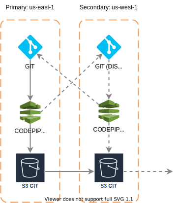

## Pre requisites
- [AWS user credentials](https://docs.aws.amazon.com/cli/latest/userguide/cli-configure-quickstart.html)
- [AWS git](https://docs.aws.amazon.com/cli/latest/userguide/cli-configure-quickstart.html)
- [UNZIP tool](https://speedysense.com/zip-and-unzip-command-in-ubuntu-terminal/)
## Description
The project at this moment is deployed in AWS infrastructure with all [FEDRAMP](https://www.fedramp.gov/)
requirements meet. To acompish this requirements the GIT repository must have a backup in case of losing the code in the repositories.

## Backup Plan
When the pipeline runs, creates a zip in their region following the pattern name <version>-<date>.zip. Each region will have a copy of the ZIP file in a s3
bucket called "git-backups-fedramp"

## Recovery Plan
To recovery a git repository in case is lost/deleted follow the next steps:
- Identify the Activated region and go to s3 and find "git-backups-fedramp" bucket.
- Download the file <version>-<date>.zip of the last version.
- if the repository is already created with the name "automation-fedramp" use the next command:
    - git clone <URL_REPOSITORY>
    - unzip <version>-<date>.zip -d <version>-<date>
    - mv <GIT_REPOSITORY>/.git <version>-<date> 
    - cd <version>-<date>
    - git add .
    - git commit -m "Backup recovery"
    - git push -f origin main
- if the repository does not exists:
    - create a repository using the AWS UI called "automation-fedramp".
    - unzip <version>-<date>.zip -d <version>-<date>
    - mv <GIT_REPOSITORY>/.git <version>-<date> 
    - cd <version>-<date>
    - git add .
    - git commit -m "Backup recovery"
    - git push -f origin main

## Test the recovery
To test the recovery plan go to the recovered Repository "automation-fedramp" on the AWS UI and check if the commit "Backup recovery" exists.