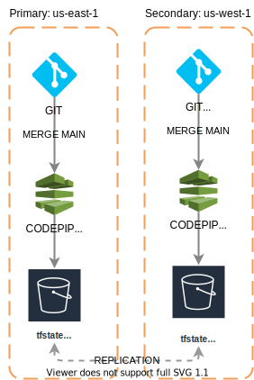

## Pre requisites
- [AWS user credentials](https://docs.aws.amazon.com/cli/latest/userguide/cli-configure-quickstart.html)
- [AWS SSH keys credentials](https://docs.aws.amazon.com/codecommit/latest/userguide/setting-up-ssh-unixes.html)

## Description
The project at this moment is deployed in AWS infrastructure with all [FEDRAMP](https://www.fedramp.gov/)
requirements meet. To acompish this requirements the SSH keys generated to access the EKS cluster need a backup plan and a recovery plan.

The project generates the next TF state files and it's executed in order:
- Global: Infrastructure that is global in AWS
- Primary(regional): Infrastructure that is in the primary region.
- secundary(regional): Infrastructure that is in the secundary region.
- terciary(regional): Infrastructure that is in the terciary region.
- Unions: Create links between regions of systems that must be connected(Like backups and replication)

## Backup Plan
The pipeline will create a ZIP file containing the 5 terraform state files and replicate them into a S3 bucket in each region, the file will have this format 
<date><hour>.zip. 

## Recovery Plan
The recovery plan is:
- download the last ZIP backup file ordered by date in the backed called **fedramp-automation-infrastructure-backups** 
- Unzip the file
- Find the bucket called **fedramp-automation-infrastructure** in the activated
- Upload the files to the S3 Bucket.

## Test the backup plan
Follow the steps to recovery the backed files and run a deployment pipeline in the active region. If the pipeline works perfectly it's a signal that the files are working properly.
