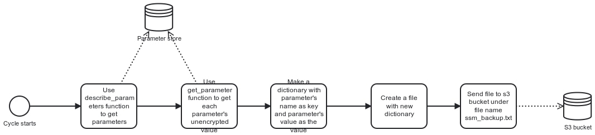

<div align="center">

</div>

# Parameters Replication

## Summary

Parameter Store is a capability of AWS Systems Manager that provides secure, hierarchical storage for configuration data management and secrets management. This service is only available in the region where is deployed. We use it to set configuration of Automation-Engine app. But if a disaster occurs in the main region we need to have the parameters replicated en the stand-by region to redeploy the app.

Parameter-replicator is a python lambda that replicate parameters from one region to another. If any parameter change, that change will be replicated in the other region, by this way we have a configuration ready to run the application in the mirror region. This lambda also run ones a day to create a parameter backup and store in S3.

## Replication process



We utilize the boto3 library to get the data from the parameter store. We utilize the `describe_parameters` function
to get all the data from the Parameter store. Since the max size of the response is 50 items we need to loop a couple
times calling `describe_parameters`.

`describe_parameters` provides all the necessary data related to the parameter from the parameter store EXCEPT the
value. In order to get the unencrypted value we need to call `get_parameter` for each parameter gotten from `describe_parameters`
response.

Once we have all the data for each parameter, we take each parameter name and value and place it in a dictionary with name 
being the key and the value being the value of that dictionary. We then format that dictionary in a file (ssm_backups.txt) looking something like:

```
[ssm_backups.txt]

some_parameter_name:12
...
...
```

Then we need to store that file in an aws s3 bucket using the boto3 function `upload_file`