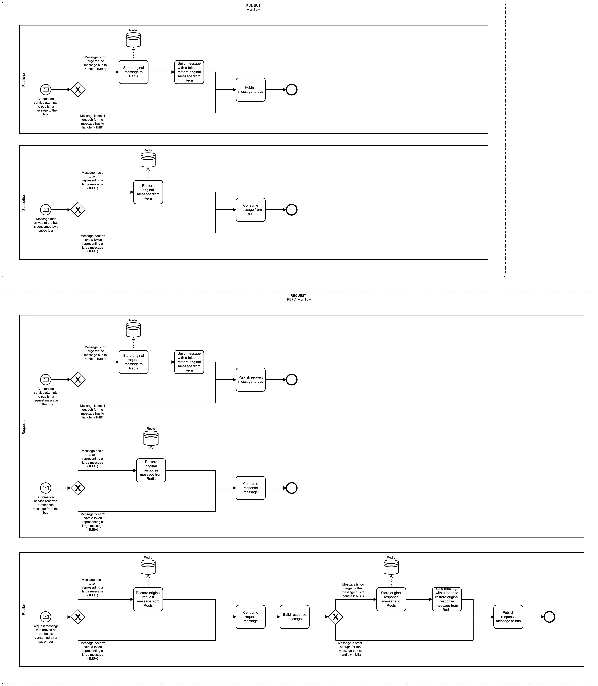

# Messages Bus Event Logging

# Description

The messages bus is the central piece of communication between the services living in the Automation system.

Services can talk to each other by publishing messages to subjects. When a service has interest on a particular
subject, any messages published to that subject will be consumed by it.

The bus provides two communication models for these services:

  * Publish / Subscribe (a.k.a. PUB / SUB). As hinted above, a service publishes a message to a subject which is later
    consumed by another service with interest in that subject.

  * Request / Reply. In this case, a service asks for data by publishing a message to a subject which is later consumed
    by another service with interest in that subject. This is pretty much a PUB/SUB flow.

    The difference here, however, is that the consumer of the message will reply with a response to the requestor. The
    requestor takes care of consuming that response message once it gets it.

Since the messages bus won't allow publishing messages larger than 1MB+, and if necessary, all services take care of
storing them to a temporary storage so consumers can restore the original message on their end.

## Process Workflows
](../../images/0-messages-bus.png)

## List of Decisions made by the Messages Bus
### PUB-SUB workflow
|     | Condition                                   | Decision                                                   | Decision                                                     |
|-----|---------------------------------------------|------------------------------------------------------------|--------------------------------------------------------------|
| 1   | Check for message size before publishing it | Message is too large for the message bus to handle (1MB+)  | Message is small enough for the message bus to handle (<1MB) |

### REQUEST-REPLY workflow
#### Requestor
|     | Condition                                           | Decision                                                  | Decision                                                         |
|-----|-----------------------------------------------------|-----------------------------------------------------------|------------------------------------------------------------------|
| 1   | Check for request message size before publishing it | Message is too large for the message bus to handle (1MB+) | Message is small enough for the message bus to handle (<1MB)     |
| 2   | Check for response message size before consuming it | Message has a token representing a large message (1MB+)   | Message doesn't have a token representing a large message (1MB+) |

#### Replier
|     | Condition                                            | Decision                                                  | Decision                                                         |
|-----|------------------------------------------------------|-----------------------------------------------------------|------------------------------------------------------------------|
| 1   | Check for request message size before consuming it   | Message has a token representing a large message (1MB+)   | Message doesn't have a token representing a large message (1MB+) |
| 2   | Check for response message size before publishing it | Message is too large for the message bus to handle (1MB+) | Message is small enough for the message bus to handle (<1MB)     |

## Event Descriptions
### Python 3.10 utils
#### Connect to messages bus
* [connect](../services/pyutils_automation/py310/src/framework/nats/client/connect.md)

#### Subscribe to subject
* [subscribe](../services/pyutils_automation/py310/src/framework/nats/client/subscribe.md)

#### PUB/SUB workflow
* [publish](../services/pyutils_automation/py310/src/framework/nats/client/publish.md)

#### REQUEST/REPLY workflow
* [request](../services/pyutils_automation/py310/src/framework/nats/client/request.md)

### Python 3.6 utils
#### Connect to messages bus
* [connect](../services/pyutils_automation/py36/igz/packages/eventbus/eventbus/connect.md)

#### Subscribe to subject
* [subscribe_consumer](../services/pyutils_automation/py36/igz/packages/eventbus/eventbus/subscribe_consumer.md)

#### PUB/SUB workflow
* [publish_message](../services/pyutils_automation/py36/igz/packages/eventbus/eventbus/publish_message.md)

#### REQUEST/REPLY workflow
* [rpc_request](../services/pyutils_automation/py36/igz/packages/eventbus/eventbus/rpc_request.md)