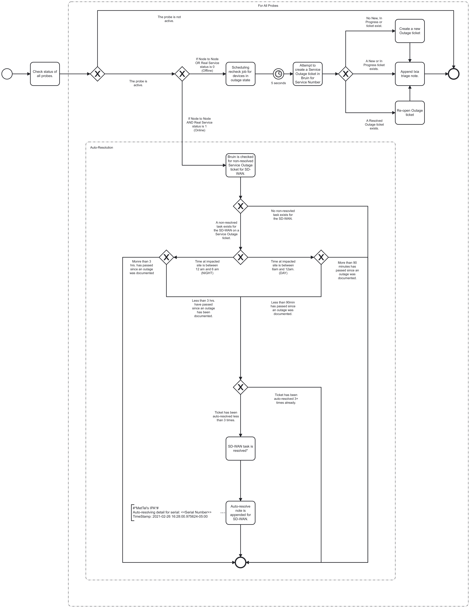

# Ixia Outage Monitoring Event Logging

## Process Workflows
](../../images/10-ixia-outage-monitoring.jpg)

## List of Decisions made by the Ixia outage monitoring System
### Ixia outage monitoring queue
#### Start of Ixia outage monitoring workflow
|                                                             |                                                                      |                                                                       |
|-------------------------------------------------------------|----------------------------------------------------------------------|-----------------------------------------------------------------------|
| 1. Checking probe status                                    | The probe is not active                                              | The probe is active                                                   |
| 2. Check Node to Node and Real service status               | Node to Node or Real service status is 0 (Offline)                   | Node to Node AND Real status is 1 (Online)                            |
| 3. Checking for non-resolved task for Service Outage ticket | A non-resolved task exists for the SD-WAN on a Service Outage ticket | No non-resolved task exists for the SD-WAN on a Service Outage ticket |
| 4. Checking for time at impacted site                       | Time at impacted site is between 12am and 6am (NIGHT)                | Time at impacted site is between 6am and 12am (DAY)                   |
| 5. Checking if time passed is more or less than 3 hrs       | More than 3 hours has passed since an outage was documented          | Less than 3 hours has passed since an outage was documented           |
| 6. Checking if time passed is more or less than 90 mins     | More than 90 mins has passed since an outage was documented          | Less than 90 mins has passed since an outage was documented           | 
| 7. Checking how mamy time ticket has been autoresolved      | Ticket has been autoresolved less than 3 times                       | Ticket has been autoresolved more than 3 times                        |                                                                           
## Event Descriptions
### Ixia outage monitoring queue
* [start_hawkeye_outage_monitoring](../services/hawkeye-outage-monitor/actions/start_hawkeye_outage_monitoring.md)