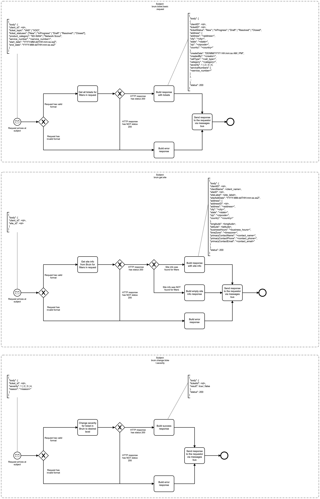

# Bruin Bridge Event Logging

# Description

The mission of this service is to act as a proxy to the Bruin API. It accepts requests from other services and yields
the requested data back to those services so they can make the appropriate business decision.

## Process Workflows
](../../images/11-bruin-bridge.png)

## List of Decisions made by the Bruin Bridge
### Subject: bruin.ticket.basic.request (aims at endpoint [GET /api/Ticket/basic](https://api.bruin.com/index.html#/Ticket/get_api_Ticket_basic))
|     | Condition                                               | Decision                     | Decision                         |
|-----|---------------------------------------------------------|------------------------------|----------------------------------|
| 1   | Check for shape and content of incoming request         | Request has valid format     | Request has invalid format       |
| 2   | Check for status of response from GET /api/Ticket/basic | HTTP response has status 200 | HTTP response has NOT status 200 |

### Subject: bruin.get.site (aims at endpoint [GET /api/Site](https://api.bruin.com/index.html#/Site/get_api_Site))
|     | Condition                                       | Decision                        | Decision                            |
|-----|-------------------------------------------------|---------------------------------|-------------------------------------|
| 1   | Check for shape and content of incoming request | Request has valid format        | Request has invalid format          |
| 2   | Check for status of response from GET /api/Site | HTTP response has status 200    | HTTP response has NOT status 200    |
| 3   | Check for existence of site's data              | Site info was found for filters | Site info was NOT found for filters |

### Subject: bruin.change.ticket.severity (aims at endpoint [PUT /api/Ticket/{ticketId}/severity](https://api.bruin.com/index.html#/Ticket/put_api_Ticket__ticketId__severity))
|     | Condition                                                             | Decision                     | Decision                         |
|-----|-----------------------------------------------------------------------|------------------------------|----------------------------------|
| 1   | Check for shape and content of incoming request                       | Request has valid format     | Request has invalid format       |
| 2   | Check for status of response from PUT /api/Ticket/{ticketId}/severity | HTTP response has status 200 | HTTP response has NOT status 200 |

## Event Descriptions
### Subject: bruin.ticket.basic.request
* [get_tickets_basic_info](../services/bruin-bridge/actions/get_tickets_basic_info.md)

### Subject: bruin.get.site
* [get_site](../services/bruin-bridge/actions/get_site.md)

### Subject: bruin.change.ticket.severity
* [change_ticket_severity](../services/bruin-bridge/actions/change_ticket_severity.md)