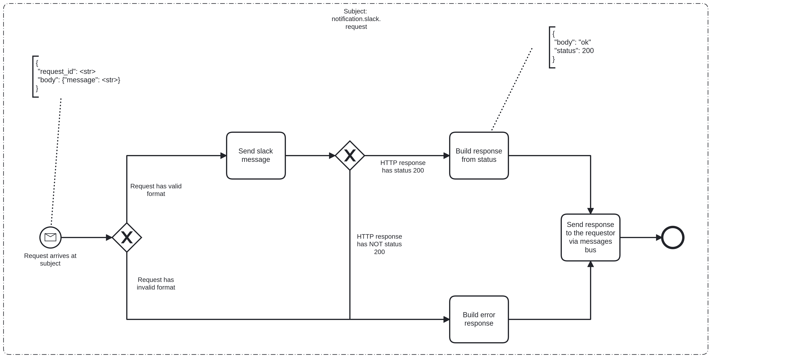

# Notifications Bridge Event Logging

# Description

The mission of this service is to act as a proxy to third-party systems focused on notifications' delivery. It accepts requests from other services and yields
the requested data back to those services, so they can make the appropriate business decision.

## Process Workflows
](../../images/13-notifications-bridge.png)

## List of Decisions made by the Notifications Bridge
### Subject: notification.slack.request (aims at endpoint [slack webhook](https://us-east-1.console.aws.amazon.com/systems-manager/parameters/?region=us-east-1&tab=Table#list_parameter_filters=Name:Contains:slack) defined in the AWS params store)
|     | Condition                                           | Decision                     | Decision                         |
|-----|-----------------------------------------------------|------------------------------|----------------------------------|
| 1   | Check for shape and content of incoming request     | Request has valid format     | Request has invalid format       |
| 2   | Check for status of response from the slack webhook | HTTP response has status 200 | HTTP response has NOT status 200 |

## Event Descriptions
### Subject: notification.slack.request
* [send_to_slack](../services/notifications-bridge/actions/send_to_slack.md)
