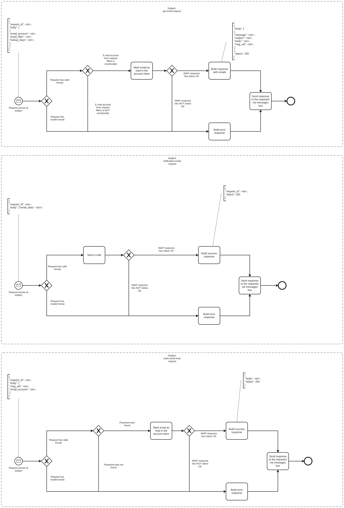

# Email Bridge Event Logging

# Description

The mission of this service is to act as a proxy to the email server. It accepts requests from other services and yields
the requested data back to those services, so they can make the appropriate business decision.

## Process Workflows
](../../images/14-email-bridge.png)

## List of Decisions made by the Email Bridge
### Subject: get.email.request (aims at the email server smtp.gmail.com:587)
|     | Condition                                          | Decision                    | Decision                        |
|-----|----------------------------------------------------|-----------------------------|---------------------------------|
| 1   | Check for shape and content of incoming request    | Request has valid format    | Request has invalid format      |
| 2   | Check for the email and password from the request  | Password was found          | Password was not found          |
| 3   | Check for status of response from the email server | IMAP response has status OK | IMAP response has NOT status OK |

### Subject: notification.email.request (aims at the email server smtp.gmail.com:587)
|     | Condition                                                        | Decision                    | Decision                        |
|-----|------------------------------------------------------------------|-----------------------------|---------------------------------|
| 1   | Check for shape and content of incoming request                  | Request has valid format    | Request has invalid format      |
| 2   | Send the email to the email account and password in our settings | IMAP response has status OK | IMAP response has NOT status OK |
| 3   | Check for status of response from the email server               | IMAP response has status OK | IMAP response has NOT status OK |

### Subject: mark.email.read.request (aims at the email server smtp.gmail.com:587)
|     | Condition                                                                       | Decision                    | Decision                        |
|-----|---------------------------------------------------------------------------------|-----------------------------|---------------------------------|
| 1   | Check for shape and content of incoming request                                 | Request has valid format    | Request has invalid format      |
| 2   | E-mail account from request                                                     | E-mail account monitorable  | E-mail account not monitorable  |
| 3   | Check for status of response from the email server to mark the email(s) as seen | IMAP response has status OK | IMAP response has NOT status OK |

## Event Descriptions
### Subject: get.email.request
* [get_emails](../services/email-bridge/actions/get_emails.md)

### Subject: notification.email.request
* [send_to_email](../services/email-bridge/actions/send_to_email.md)

### Subject: mark.email.read.request
* [mark_email_as_read](../services/email-bridge/actions/mark_email_as_read.md)