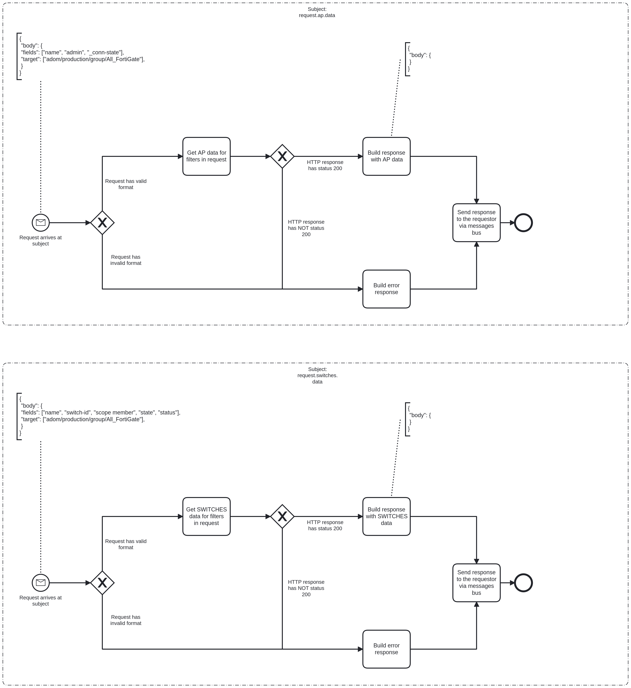

# Forticloud Bridge Event Logging

# Description

The mission of this service is to act as a proxy to the Forticloud API. It accepts requests from other services and yields
the requested data back to those services, so they can make the appropriate business decision.

## Process Workflows
](../../images/15-forticloud-bridge.png)

## List of Decisions made by the Forticloud Bridge
### Subject: request.ap.data (aims at endpoint POST /pm/config/adom/demo/obj/wireless-controller/wtp)
|     | Condition                                                                               | Decision                     | Decision                         |
|-----|-----------------------------------------------------------------------------------------|------------------------------|----------------------------------|
| 1   | Check for shape and content of incoming request                                         | Request has valid format     | Request has invalid format       |
| 2   | Check for status of response from POST /pm/config/adom/demo/obj/wireless-controller/wtp | HTTP response has status 200 | HTTP response has NOT status 200 |

### Subject: request.switches.data (aims at endpoint POST /pm/config/adom/demo/obj/fsp/managed-switch)
|     | Condition                                                                          | Decision                     | Decision                         |
|-----|------------------------------------------------------------------------------------|------------------------------|----------------------------------|
| 1   | Check for shape and content of incoming request                                    | Request has valid format     | Request has invalid format       |
| 2   | Check for status of response from POST /pm/config/adom/demo/obj/fsp/managed-switch | HTTP response has status 200 | HTTP response has NOT status 200 |

## Event Descriptions
### Subject: request.ap.data
* [get_ap_data](../services/forticloud-bridge/actions/get_ap_data.md)

### Subject: request.switches.data
* [get_switches_data](../services/forticloud-bridge/actions/get_switches_data.md)
