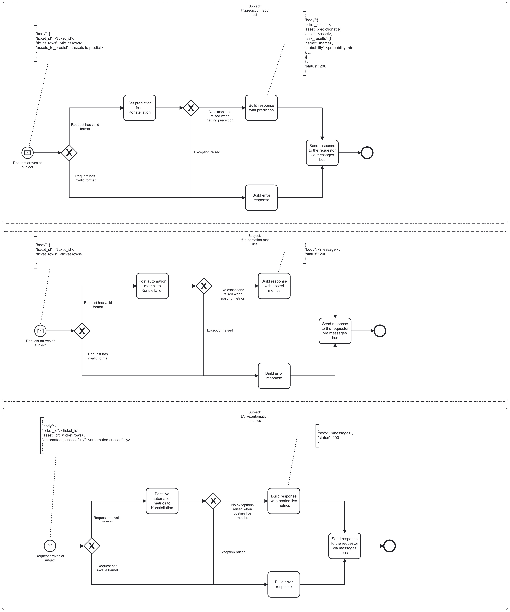

# DRI Bridge Event Logging

# Description

T7 Bridge is used to make calls to Konstellation. It gets predictions and post live and non-live metrics.

## Process Workflows
](../../images/18-t7-bridge.jpg)

## List of Decisions made by the T7 Bridge
### Subject: t7.prediction.request
|     | Condition                                                             | Decision                                      | Decision                   |
|-----|-----------------------------------------------------------------------|-----------------------------------------------|----------------------------|
| 1   | Check for shape and content of incoming request                       | Request has valid format                      | Request has invalid format |
| 2   | Check for raised exceptions when making Prediction Konstellation call | No exceptions raised when getting prediction  | Exception raised           |

### Subject: t7.automation.metrics
|     | Condition                                                               | Decision                                        | Decision                    |
|-----|-------------------------------------------------------------------------|-------------------------------------------------|-----------------------------|
| 1   | Check for shape and content of incoming request                         | Request has valid format                        | Request has invalid format  |
| 2   | Check for raised exceptions when making SaveMetrics Konstellation call  | No exceptions raised when when posting metrics  | Exception raised            |

### Subject: t7.live.automation.metrics
|     | Condition                                                                  | Decision                                            | Decision                   |
|-----|----------------------------------------------------------------------------|-----------------------------------------------------|----------------------------|
| 1   | Check for shape and content of incoming request                            | Request has valid format                            | Request has invalid format |
| 2   | Check for raised exceptions when making SaveLiveMetrics Konstellation call | No exceptions raised when when posting live metrics | Exception raised           |

## Event Descriptions
### Subject: t7.prediction.request
* [get_prediction](../services/t7-bridge/actions/get_prediction.md)

### Subject: t7.automation.metrics
* [post_automation_metrics](../services/t7-bridge/actions/post_automation_metrics.md)

### Subject: t7.live.automation.metrics
* [post_live_automation_metrics](../services/t7-bridge/actions/post_live_automation_metrics.md)