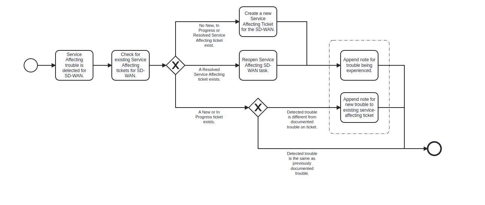

# Service affecting Event Logging

## Process Workflows

## List of Decisions made by the service affecting System
### Service affecting queue
#### Start of  service affecting workflow

|                                    |                                                          |                                         |                          |
|------------------------------------|----------------------------------------------------------|-----------------------------------------|--------------------------|
| 1. Detected service trouble SD-WAN |                                                          |                                         |                          |
| 2. Check if exist ticket           | No new, in progress or resolved ticket created           | Exist a resolve ticket                  | New or in progress exist |
| 3. If no exist ticket              | Create ticket and append note for trouble                |                                         |                          |
| 4. If resolved ticket exist        | Reopen ticket and append note for trouble                |                                         |                          |
| 5. If exist in progress ticket     | Check if is the same problem, if is the same end process | If not the same trouble append new note |                          |

## Event Descriptions
### Service affecting queue
* [_attempt_ticket_creation](../services/service-affecting-monitor/actions/_service_affecting_monitor_process.md)
