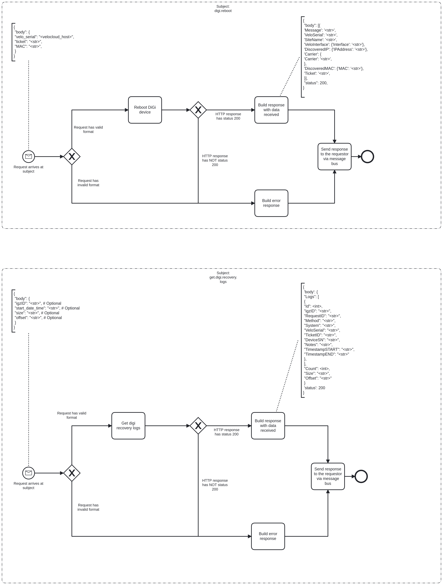

---
hide:
  - navigation
  - toc
---

# Digi Bridge Event Logging

# Description

The DiGi bridge is mainly used to call the DiGi API to reboot DiGi devices.

## Process Workflows
](../../images/digi-bridge.png)

## List of Decisions made by the Digi Bridge
### Subject: digi.reboot (aims at endpoint GET /DeviceManagement_API/rest/Recovery/RecoverDevice)
|     | Condition                                                                               | Decision                     | Decision                         |
|-----|-----------------------------------------------------------------------------------------|------------------------------|----------------------------------|
| 1   | Check for shape and content of incoming request                                         | Request has valid format     | Request has invalid format       |
| 2   | Check for status of response from GET /DeviceManagement_API/rest/Recovery/RecoverDevice | HTTP response has status 200 | HTTP response has NOT status 200 |

### Subject: get.digi.recovery.logs (aims at endpoint GET /DeviceManagement_API/rest/Recovery/Logs)
|     | Condition                                                                      | Decision                     | Decision                         |
|-----|--------------------------------------------------------------------------------|------------------------------|----------------------------------|
| 1   | Check for shape and content of incoming request                                | Request has valid format     | Request has invalid format       |
| 2   | Check for status of response from GET /DeviceManagement_API/rest/Recovery/Logs | HTTP response has status 200 | HTTP response has NOT status 200 |

## Event Descriptions
### Authentication management
#### Schedule DiGi Login job
* [login_job](../services/digi-bridge/repositories/digi_repository/login_job.md)

### Bridge capabilities
#### Subject: digi.reboot
* [digi_reboot](../services/digi-bridge/actions/digi_reboot.md)

#### Subject: get.digi.recovery.logs
* [get_digi_recovery_logs](../services/digi-bridge/actions/get_digi_recovery_logs.md)
