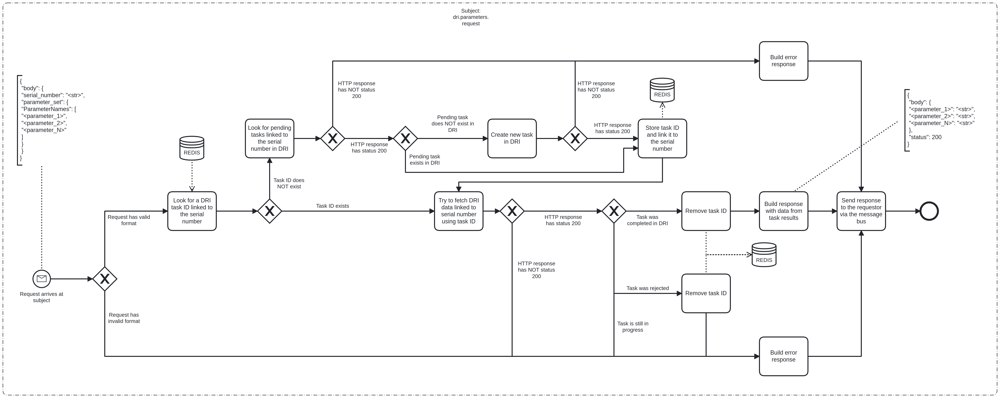

# DRI Bridge Event Logging

# Description

DRI Bridge is used to make calls to the DRI API. The main call includes [get_dri_parameters](#get-dri-parameters) which comprises
three different endpoint calls to the DRI API.

## Process Workflows
](../../images/dri-bridge.png)

## List of Decisions made by the DRI Bridge
### Subject: dri.parameters.request
|     | Condition                                                                                                | Decision                     | Decision                           | Decision                  |
|-----|----------------------------------------------------------------------------------------------------------|------------------------------|------------------------------------|---------------------------|
| 1   | Check for shape and content of incoming request                                                          | Request has valid format     | Request has invalid format         |                           |
| 2   | Check for status of response from POST /acs/device/{serial_number}/parameter_tid?transactionid={task_id} | HTTP response has status 200 | HTTP response has NOT status 200   |                           |
| 3   | Check for status of response from POST /acs/device/{serial_number}/parameter_returnid?data={parameters}  | HTTP response has status 200 | HTTP response has NOT status 200   |                           |
| 4   | Check for status of response from POST /acs/device/{serial_number}/taskpending                           | HTTP response has status 200 | HTTP response has NOT status 200   |                           |
| 5   | Check for existence of task ID in IPA system's Redis                                                     | Task ID exists               | Task ID does NOT exist             |                           |
| 6   | Check for existence of pending task ID in DRI system                                                     | Pending task exists in DRI   | Pending task does NOT exist in DRI |                           |
| 7   | Check for status of in-progress task                                                                     | Task was completed in DRI    | Task was rejected                  | Task is still in progress |

## Event Descriptions
### Subject: dri.parameters.request
* [get_dri_parameters](../services/dri-bridge/actions/get_dri_parameters.md)