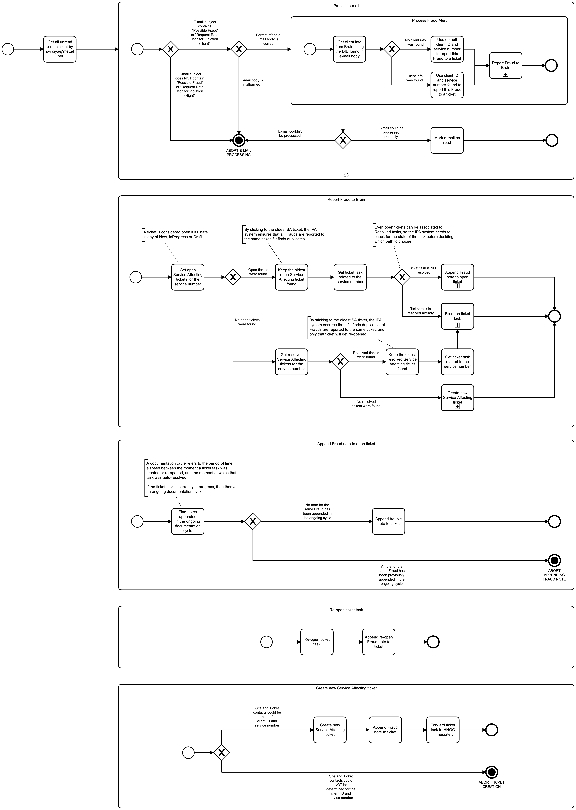

# Fraud Monitor Event Logging

# Description

The goal of the `fraud-monitor` service is to get unread fraud warning emails and create fraud tickets for them.

## Process Workflows
](../../images/fraud-monitor.png)

## List of Decisions made by the Fraud Monitor service
_This service does not make any business decision_

## Event Descriptions
### Schedule Fraud Monitoring job
* [start_fraud_monitoring](../services/fraud-monitor/actions/start_fraud_monitoring.md)

### Run Fraud Monitoring Process job
* [_fraud_monitoring_process](../services/fraud-monitor/actions/_fraud_monitoring_process.md)
