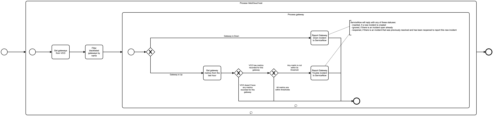

---
hide:
  - navigation
  - toc
---

# Gateway Monitor Event Logging

# Description

The mission of this service is to analyze VeloCloud gateways' statuses and metrics, and report issues to ServiceNow (if any).

## Process Workflows
{loading=lazy}

## List of Decisions made by the Gateway Monitor
### Process Gateway workflow
|     | Condition                                                  | Decision                                                | Decision                                  |
|-----|------------------------------------------------------------|---------------------------------------------------------|-------------------------------------------|
| 1   | Check for current gateway status                           | Gateway is Down                                         | Gateway is Up                             |
| 2   | Check for availability of metrics for a particular gateway | VCO does not have any metrics recorded for this gateway | VCO has metrics recorded for this gateway |
| 3   | Check for metrics being within thresholds                  | All metrics are within thresholds                       | Any metric is not within its threshold    |

## Event Descriptions
### Start Gateway Monitoring
* [start_monitoring](../services/gateway-monitor/actions/start_monitoring.md)

### Process VeloCloud host
* [_process_host](../services/gateway-monitor/actions/_process_host.md)
