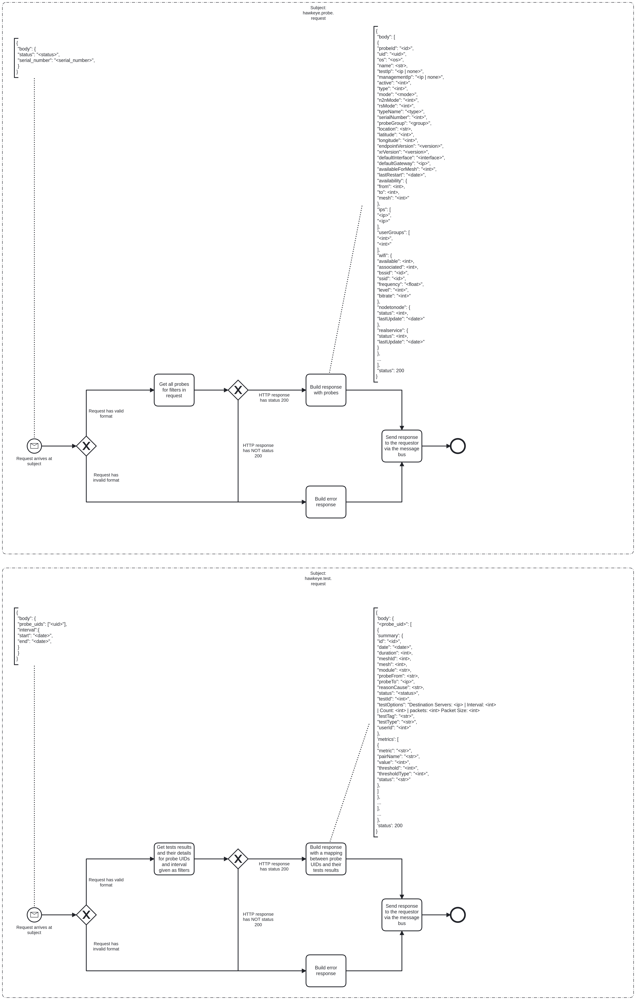

---
hide:
  - navigation
  - toc
---

# Hawkeye Bridge Event Logging

# Description

Hawkeye Bridge is used to make calls to the Hawkeye API.

## Process Workflows
{loading=lazy}

## List of Decisions made by the Hawkeye Bridge
### Subject: hawkeye.probe.request (aims at endpoint [GET /probes])
|     | Condition                                       | Decision                     | Decision                         |
|-----|-------------------------------------------------|------------------------------|----------------------------------|
| 1   | Check for shape and content of incoming request | Request has valid format     | Request has invalid format       |
| 2   | Check for status of response from GET /probes   | HTTP response has status 200 | HTTP response has NOT status 200 |

### Subject: hawkeye.test.request (aims at endpoint [GET /testsresults])
|     | Condition                                           | Decision                     | Decision                         |
|-----|-----------------------------------------------------|------------------------------|----------------------------------|
| 1   | Check for shape and content of incoming request     | Request has valid format     | Request has invalid format       |
| 2   | Check for status of response from GET /testsresults | HTTP response has status 200 | HTTP response has NOT status 200 |

## Event Descriptions
### Subject: hawkeye.probe.request
* [get_probes](../services/hawkeye-bridge/actions/get_probes.md)

### Subject: hawkeye.test.request
* [get_test_results](../services/hawkeye-bridge/actions/get_test_results.md)