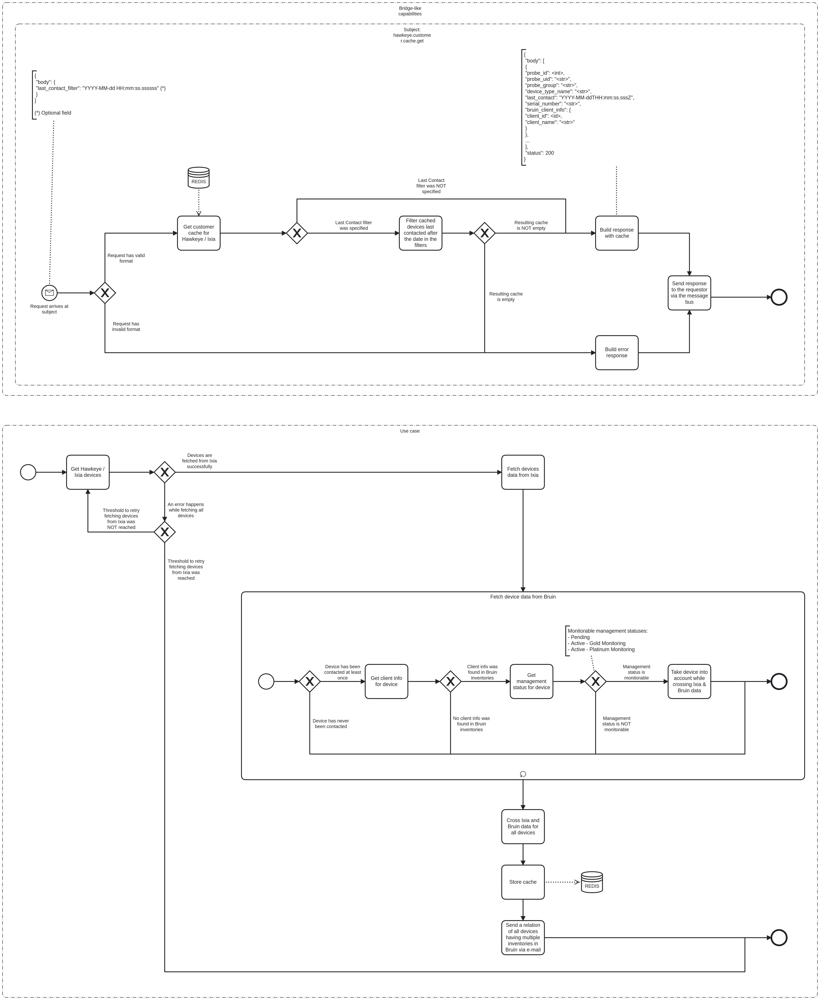

---
hide:
  - navigation
  - toc
---

# Hawkeye Customer Cache Event Logging

# Description

The Hawkeye Customer Cache service has two responsibilities:

* Run a periodic job that retrieves non-volatile data from Hawkeye / Ixia and Bruin for all devices, and then cross the
  data from both systems and store the resulting cache to a Redis instance. The cache will remain valid until the next successful
  execution of the job.
* Serve the cache built from execution of the previously mentioned job to other services in the system.

## Process Workflows
](../../images/hawkeye-customer-cache.png)

## List of Decisions made by the Hawkeye Customer Cache service
### Bridge-like capabilities
#### Subject: hawkeye.customer.cache.get
|     | Condition                                                           | Decision                          | Decision                                 |
|-----|---------------------------------------------------------------------|-----------------------------------|------------------------------------------|
| 1   | Check for shape and content of incoming request                     | Request has valid format          | Request has invalid format               |
| 2   | Check for Last Contact filter in the request payload                | Last Contact filter was specified | Last Contact filter was NOT specified    |
| 3   | Check for emptiness of cache after filtering by Last Contact filter | Resulting cache is NOT empty      | Resulting cache is empty                 |

### Use case
#### Overall workflow
|     | Condition                                                                                | Decision                                                  | Decision                                                      |
|-----|------------------------------------------------------------------------------------------|-----------------------------------------------------------|---------------------------------------------------------------|
| 1   | Check for devices successfully retrieved from Ixia                                       | Devices are fetched from VCOs successfully                | An error happens while fetching all devices                   |
| 1   | Check if the threshold to retry fetching devices from Ixia after a failure was maxed out | Threshold to retry fetching devices from VCOs was reached | Threshold to retry fetching devices from VCOs was NOT reached |

### Workflow - Fetch device data from Bruin
|     | Condition                                                   | Decision                                   | Decision                                      |
|-----|-------------------------------------------------------------|--------------------------------------------|-----------------------------------------------|
| 1   | Check if the device has ever been contacted                 | Device has been contacted at least once    | Device has never been contacted               |
| 2   | Check for existence of client info in Bruin for the device  | Client info was found in Bruin inventories | No client info was found in Bruin inventories |
| 3   | Check if the management status of the device is monitorable | Management status is monitorable           | Management status is NOT monitorable          |

## Event Descriptions
### Bridge-like capabilities
#### Subject: customer.cache.get
* [get_customers](../services/hawkeye-customer-cache/actions/get_customers/get_customers.md)

### Use case
#### Schedule Hawkeye Customer Cache Refresh job
* [schedule_cache_refresh](../services/hawkeye-customer-cache/actions/refresh_cache/schedule_cache_refresh.md)

### Run Hawkeye Customer Cache Refresh job
* [_refresh_cache](../services/hawkeye-customer-cache/actions/refresh_cache/_refresh_cache.md)
