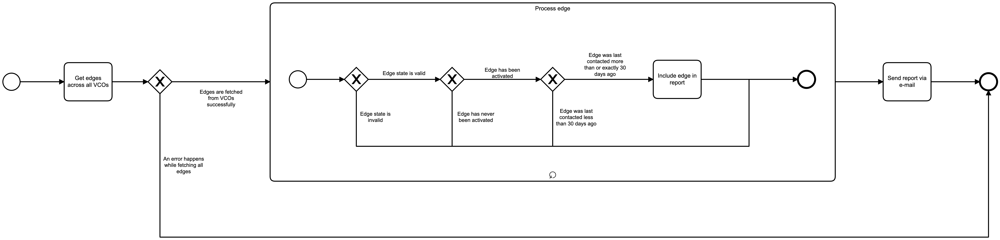

# Last Contact Report Event Logging

# Description

The Last Contact Report service is responsible for running a job every first day of the month. The job makes sure to
gather the edges across all VCOs, and send via e-mail a summary of the edges that have been last contacted by the VCO
where they belong more than 30 days ago.

## Process Workflows
](../../images/last-contact-report.png)

## List of Decisions made by the Last Contact Report service
### Overall workflow
|     | Condition                                                                                                | Decision                                 | Decision                                  |
|-----|----------------------------------------------------------------------------------------------------------|------------------------------------------|-------------------------------------------|
| 1   | Check for edges successfully retrieved from the VCOs                                                     | Edges are fetched from VCOs successfully | An error happens while fetching all edges |

### Process Edge workflow
|     | Condition                                        | Decision                                                 | Decision                                      |
|-----|--------------------------------------------------|----------------------------------------------------------|-----------------------------------------------|
| 1   | Check for the moment the edge was last contacted | Edge was last contacted more than or exactly 30 days ago | Edge was last contacted less than 30 days ago |
| 2   | Check for validity of edge state                 | Edge state is invalid                                    | Edge state is valid                           |
| 3   | Check for activation state of edge               | Edge has been activated                                  | Edge has never been activated                 |

## Event Descriptions
### Schedule Last Contact Report job
* [start_alert_job](../services/last-contact-report/actions/alert/start_alert_job.md)

### Run Last Contact Report job
* [_alert_job](../services/last-contact-report/actions/alert/_alert_job.md)
