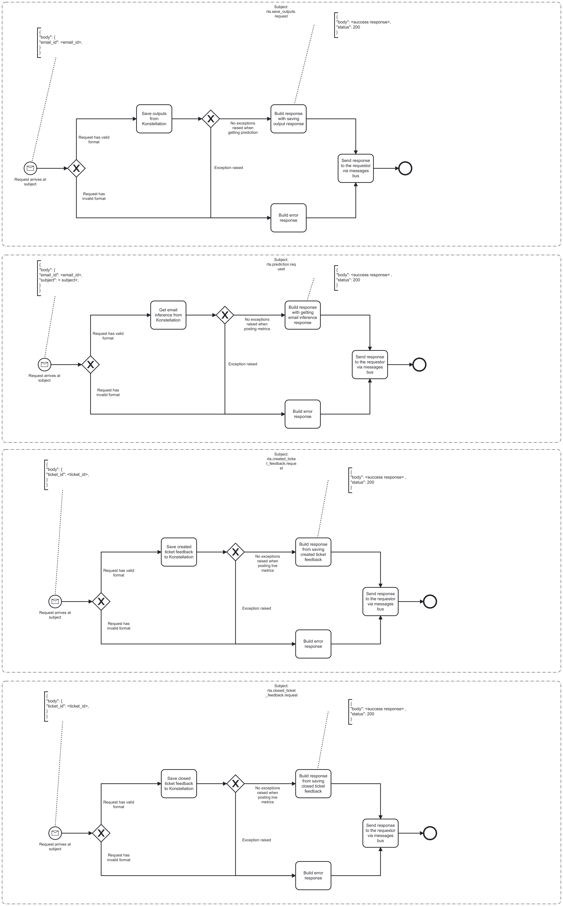

---
hide:
  - navigation
  - toc
---

# Repair tickets kre bridge

# Description

Repair tickets kre bridge is used to make calls to Konstellation. It gets email inference, save closed and created ticket feedback, and it saves outputs

## Process Workflows
{loading=lazy}

## List of Decisions made by the Repair tickets kre bridge
### Subject: rta.save_outputs.request
|     | Condition                                                                | Decision                                      | Decision                   |
|-----|--------------------------------------------------------------------------|-----------------------------------------------|----------------------------|
| 1   | Check for shape and content of incoming request                          | Request has valid format                      | Request has invalid format |
| 2   | Check for raised exceptions when making SaveOutputs Konstellation call   | No exceptions raised when getting prediction  | Exception raised           |

### Subject: rta.prediction.request
|     | Condition                                                                  | Decision                                        | Decision                    |
|-----|----------------------------------------------------------------------------|-------------------------------------------------|-----------------------------|
| 1   | Check for shape and content of incoming request                            | Request has valid format                        | Request has invalid format  |
| 2   | Check for raised exceptions when making GetPrediction Konstellation call   | No exceptions raised when when posting metrics  | Exception raised            |

### Subject: rta.created_ticket_feedback.request
|     | Condition                                                                               | Decision                                            | Decision                   |
|-----|-----------------------------------------------------------------------------------------|-----------------------------------------------------|----------------------------|
| 1   | Check for shape and content of incoming request                                         | Request has valid format                            | Request has invalid format |
| 2   | Check for raised exceptions when making SaveCreatedTicketsFeedback Konstellation call   | No exceptions raised when when posting live metrics | Exception raised           |

### Subject: rta.closed_ticket_feedback.request
|     | Condition                                                                                | Decision                                            | Decision                   |
|-----|------------------------------------------------------------------------------------------|-----------------------------------------------------|----------------------------|
| 1   | Check for shape and content of incoming request                                          | Request has valid format                            | Request has invalid format |
| 2   | Check for raised exceptions when making SaveClosedTicketsFeedback Konstellation call     | No exceptions raised when when posting live metrics | Exception raised           |

## Event Descriptions
### Subject: rta.save_outputs.request
* [save_outputs](../services/repair-tickets-kre-bridge/actions/save_outputs.md)

### Subject: rta.prediction.request
* [get_email_inference](../services/repair-tickets-kre-bridge/actions/get_email_inference.md)

### Subject: rta.created_ticket_feedback.request
* [save_created_ticket_feedback](../services/repair-tickets-kre-bridge/actions/save_created_ticket_feedback.md)

### Subject: rta.closed_ticket_feedback.request
* [save_closed_ticket_feedback](../services/repair-tickets-kre-bridge/actions/save_closed_ticket_feedback.md)