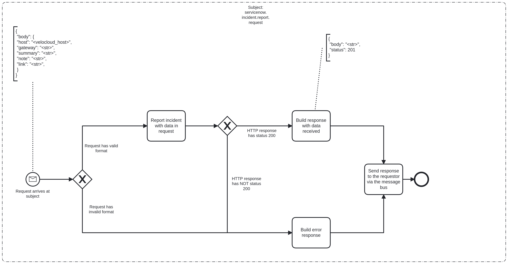

---
hide:
  - navigation
  - toc
---

# Service Now Bridge Event Logging

# Description

The `servicenow-bridge` is used to call to the ServiceNow API.

## Process Workflows
](../../images/servicenow-bridge.png)

## List of Decisions made by the Service Now Bridge
### Subject: servicenow.incident.report.request
|     | Condition                                                     | Decision                     | Decision                         |
|-----|---------------------------------------------------------------|------------------------------|----------------------------------|
| 1   | Check for shape and content of incoming request               | Request has valid format     | Request has invalid format       |
| 2   | Check for status of response from POST /api/g_mtcm/intelygenz | HTTP response has status 200 | HTTP response has NOT status 200 |

## Event Descriptions
### Subject: servicenow.incident.report.request
* [report_incident](../services/servicenow-bridge/actions/report_incident.md)
