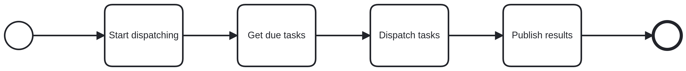

---
hide:
  - navigation
  - toc
---

# Task Dispatcher Event Logging

# Description

The `task-dispatcher` service is in charge of getting due tasks and executing them at the appropriate time.

  Supported tasks are:

  * Forward ticket tasks to Bruin work queues

## Process Workflows
](../../images/task-dispatcher.png)

## List of Decisions made by the Task Dispatcher Report service
_This service does not make any business decision_

## Event Descriptions
### Schedule Task Dispatcher job
* [start_dispatching](../services/task-dispatcher/actions/start_dispatching.md)

### Run Task Dispatcher job
* [_dispatch_due_tasks](../services/task-dispatcher/actions/_dispatch_due_tasks.md)