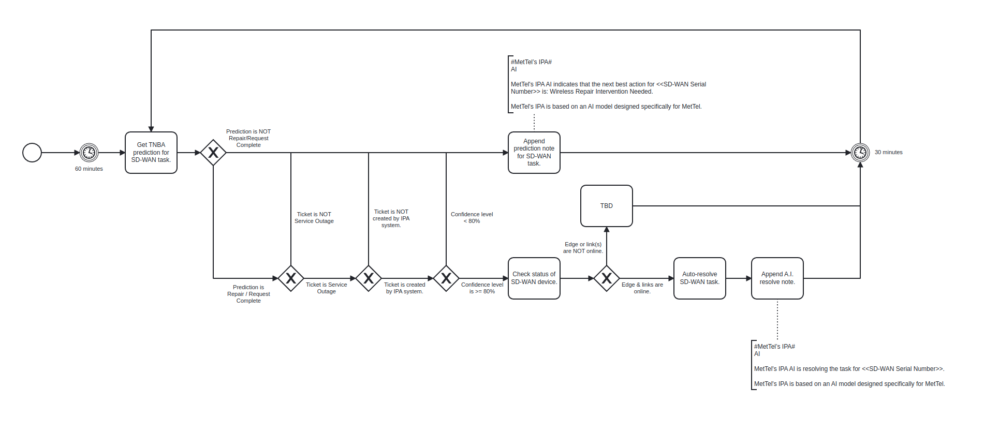

---
hide:
  - navigation
  - toc
---

 **1. <G** ent Logging

## Process Workflows

{loading=lazy}

## List of Decisions made by the TNBA Monitor

|                                        |                                        |                                    |
|----------------------------------------|----------------------------------------|------------------------------------|
| 1. Get TNBA prediction for SD-WAN task | Prediction not repair request complete | Prediction repair request complete |
|                                        | Ticket is not outage                   | Ticket is outage                   |
|                                        | Ticket is not created by IPA           | Ticket created by IPA              |
|                                        | Confidence level is < 80               | Confidence level is > 80           |
| 2. Append prediction note SD-WAN       | -                                      | -                                  |
| 3. Check status SD-WAN                 | Edge or link not online                | Edge and links online              |
| 4. TBD                                 | -                                      | -                                  |
| 5. Autoresolve SD-WAN task             | -                                      | -                                  |
| 6. Append A.I. resolve note            | -                                      | -                                  |

#### Start of TNBA Monitor
#### Event description
* [Start TNBA automated process](../services/tnba-monitor/actions/start_tnba_automated_process.md)

