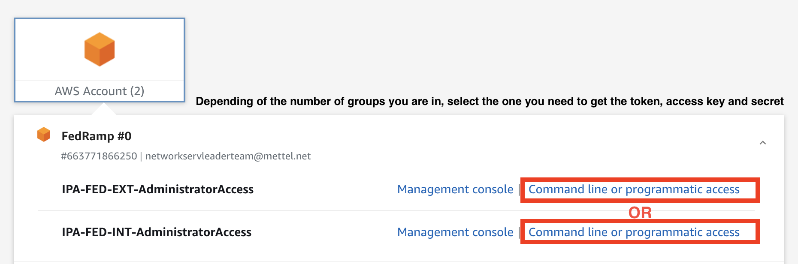
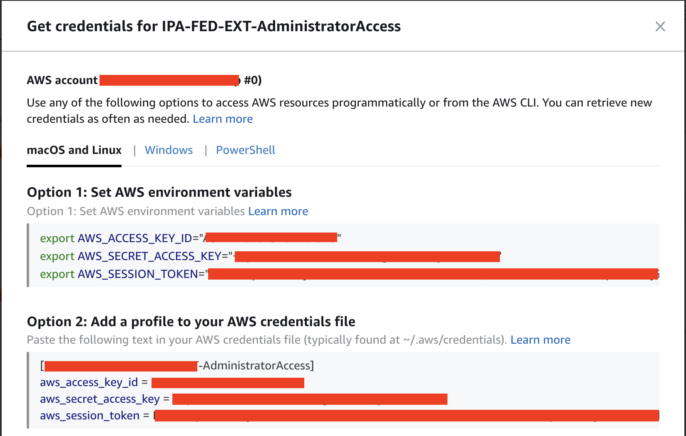

### DESCRIPTION
Because the Okta SSO login with the AWS account, not work as usual with a SSH KEY. Instead, follow the steps to be able to 
run the git commands as usual. You will need to run this process without the install of the tool "git-remote-codecommit" each time the token expire.

### INFORMATION LINKS
- [Git Remote Code commit](https://github.com/aws/git-remote-codecommit)
- [AWS setting up git remote codecommit](https://docs.aws.amazon.com/codecommit/latest/userguide/setting-up-git-remote-codecommit.html)

### STEPS

- Add your credentials in the .aws/credentials after the Okta login in AWS.

- Run the configure command of AWS:
    aws configure --profile <name_of the profile>
- Leave without modification the AWS Access Key ID, AWS Secret Access Key in the configure command.
- Fill the default region name on us-east-1 or us-west-1 depending of your necesity.
- Fill the "Default output format" with json format.
- Install git-remote-codecommit tool:
    pip install git-remote-codecommit
- Run git clone:
    command: git clone codecommit://<name_profile>@fedramp-automation-engine
    example: git clone codecommit://XXXXXXXXX_IPA-FED-EXT-AdministratorAccess@fedramp-automation-engine
    * Notice that the name_profile make reference to the name of the .aws/credentials
