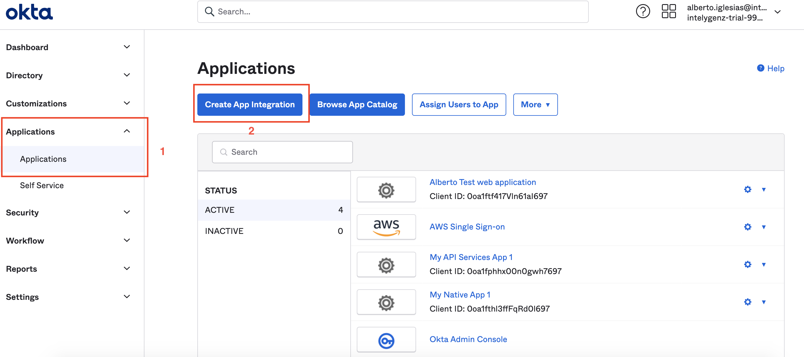
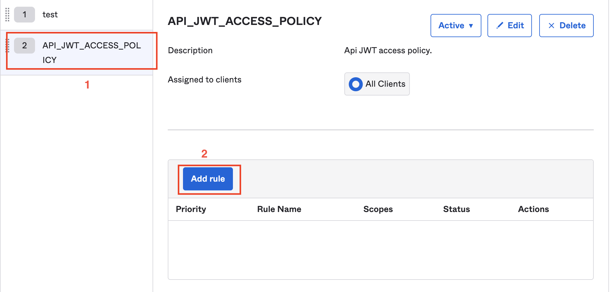

# Creation of Oauth Application for Data Highway API
## Pre requisites
- Okta Account
- AWS Account

## Description
API needs a way to verify the access of vendors and internal users provided from Okta. They way to do it is about provide
a JWT from Okta with a company name information on it.

## Group API access
First steep is about the creation of a group for the API access, only members with his group will access the API.
The groups must have the next values:
* Name: IGZ-INT-DATA-HIGHWAY-API
* Description: API Data highway access group.

* Name: IGZ-EXT-DATA-HIGHWAY-API
* Description: API Data highway access group.

## Create Application server
1. To create an application destined for the API, we are gonna need to go to "Applications/Applications" and click on create
app integration

2. A new form will show and we need to fill it with the next information:
   1. App integration name: IGZ-DATA-HIGHWAY-API
   2. Grant type: Select "Authorization Code" and "Resource Owner Password"
   3. Controlled access: Select "Limit access to selected groups"
   4. Selected groups: IGZ-INT-DATA-HIGHWAY-API, IGZ-EXT-DATA-HIGHWAY-API
   5. Click Save.

## Create Authorization server
1. In the Admin Dashboard, go to security/API and click on add authorization server.
   
2. We will need to fill the name, audience, and description. the next values are the selected ones:
   * Name: API-DATA-HIGHWAY
   * Audience: API-DATA-HIGHWAY
   * Description: API data highway access.

   After filling this form, click on the save button.
3. With the Authorization server created, we need to add some extra configurations. Go to the Claims menu following the next image

   1. Click on "Add claim"
   2. Fill the new claim with the next information:
      1. Name: organization
      2. Include in token type: "Id Token" - "Always"
      3. Value type: "Expression"
      4. Value: user.organization
      5. Include in: "Any scope"
4. Go to access policies menu following the next image:

   1. in this menu click in the button "Add new access policy"
   2. it will appear a new form, fill it with the next values and click on create policy:
      1. Name: IGZ-DATA-HIGHWAY-API-JWT-ACCESS-POLICY
      2. Description: Api JWT access policy.
      3. Assign to: IGZ-INT-DATA-HIGHWAY-API, IGZ-EXT-DATA-HIGHWAY-API

   
   3. After closing the form, select the policy created and click on the "Add rule" button. And fill the form with the next information:
      1. Rule Name: IGZ-DATA-HIGHWAY-API-ACCESS-RULE
      2. Grant type is: Select "Client credentials" and "Resource Owner Password"
      3. Assigned the app and a member of one of the following: Add the groups "IGZ-INT-DATA-HIGHWAY-API, IGZ-EXT-DATA-HIGHWAY-API".
      4. The following scopes: profiles and openid
      5. but will expire if not used every: 1 h
      
## Update Application with new parameters
1. we are going to need to go to "Applications/Applications" and update the configuration of the application "IGZ-DATA-HIGHWAY-API".
   1. Disable User consent in general configurations.

