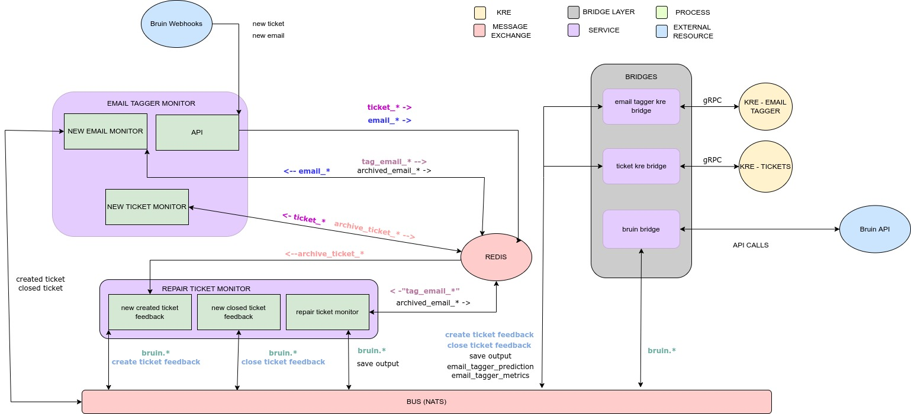

# Email Tagger Monitor
  * [Architecture](#architecture)
  * [Service general description](#service-general-description)
  * [Monitoring emails](#monitoring-emails)
  * [Sending feedback to KRE](#sending-feedback-to-kre)
  * [Capabilities used](#capabilities-used) 
  * [Running in docker-compose](#running-in-docker-compose)

# Architecture

# Service general description
The goals of this services are:
1. Receive webhooks about new emails from Bruin
2. Receive webhooks about new tickets from Bruin
3. Enrich tickets with KRE pridictions for new emails
4. Report metrics to KRE

## Process: Quart API
 This process expose these POST endpoints to receive webhook from Bruin

### `/email`
Listen Bruin webhooks about new emails and save the email in Redis with the pattern `email_{email_id}`

### `/ticket`
Listen Bruin webhooks about new tickets and save the ticket in Redis with the pattern `ticket_{email_id}_{ticket_id}`

## Process: New email monitor
Span Redis for new emails looking for the keys that `email_*` that were saved by the `/email` API endpoint. If there emails to process, ask for prediction to [email-tagger-kre-bridge](../email-tagger-kre-bridge/README.md).

Then the process rename the tag `email_{email_id}` to `archived_email_*`. 
Finally the process save a new tag with the patern `tag_email_{email_id}`. This tags will be listen by [repait-tickets-monitor -> repair-tickets-monitor](../repair_tickets_monitor/src/application/actions/repair_tickets_monitor.py) that will try to create or update bruin tickets based on this information.

## Process: New ticket monitor
Span Redis for new tickets lokking for the keys that match `ticket_*.`. Then check if the ticket is valid and send the valid tickets to [email-tagger-kre-bridge](../email-tagger-kre-bridge/README.md).

# Capabilities used
- [Bruin bridge](../bruin-bridge/README.md)
- [email-tagger-kre-bridge](../email-tagger-kre-bridge/README.md)
- [Notifier](../notifier/README.md)

# Running in docker-compose
`docker-compose up --build nats-server redis redis-email-tagger`
`docker-compose up --build bruin-bridge email-tagger-kre-bridge notifier`
`docker-compose up --build email-tagger-monitor`

## Bruin-mock in local
TODO: Complete in the another MR

## KRE in local
TODO: Complete in the another MR