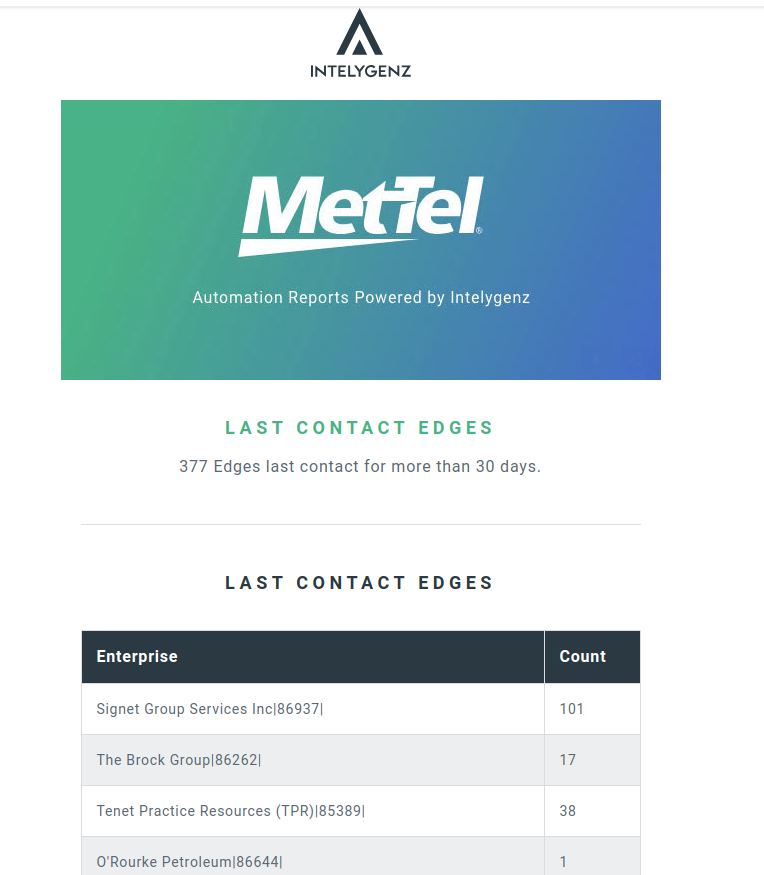

# Table of contents
  * [Description](#description)
  * [Work Flow](#work-flow)
  * [Capabilities used](#capabilities-used) 
  * [Running in docker-compose](#running-in-docker-compose)

# Description
The last contact service's job is to report on edges that have were last contacted more than 30 days ago.
This report is sent in an email with contents of the name of the enterprise and the amount of edges that were last
contacted more than 30 days ago along with a csv file attached. The CSV contains each edge detailed, with the time elapsed since activation, and the months that are left before 36 months of service has passed. Also there's an URL to visit the edge overview in Velocloud.

# Work Flow
Last contact's function `_alert_process` is called by apscheduler the first day of every month. 
Last contact makes a call to the velocloud bridge to return a list of links statuses. Since this process doesn't care about info specifically related to links,
it retains information about the edges from these links and discards the rest of info.
With this information we can go through each edge and determine whether or not they were last contacted
more than 30 days through the last contact field in the edge status.
 
Once we've determined its been more than 30 days we append this edge information to a list of edges that will be reported in a .csv file. The fields we grab are
enterprise name, serial number, model number, last contact date, amount of month its been since last contact, how much
more months are left until its been 3 years, and the url to the edge.
 
Next using the `compose_email_object` function we format this ordered dict for the csv file to be sent with the email.
At the same time we are counting the number of edges that were last contacted per enterprise for the template of the email.
Should look something like this.

 And the attached csv should look like this:
 [example-csv](readme-resources/example.csv)
 
# Capabilities used
- [Velocloud bridge](../velocloud-bridge/README.md)
- [Email bridge](../email-bridge/README.md)
- [Notifications bridge](../notifications-bridge/README.md)

# Running in docker-compose 
`docker-compose up --build redis last-contact-report velocloud-bridge email-bridge notifications-bridge nats-server`
