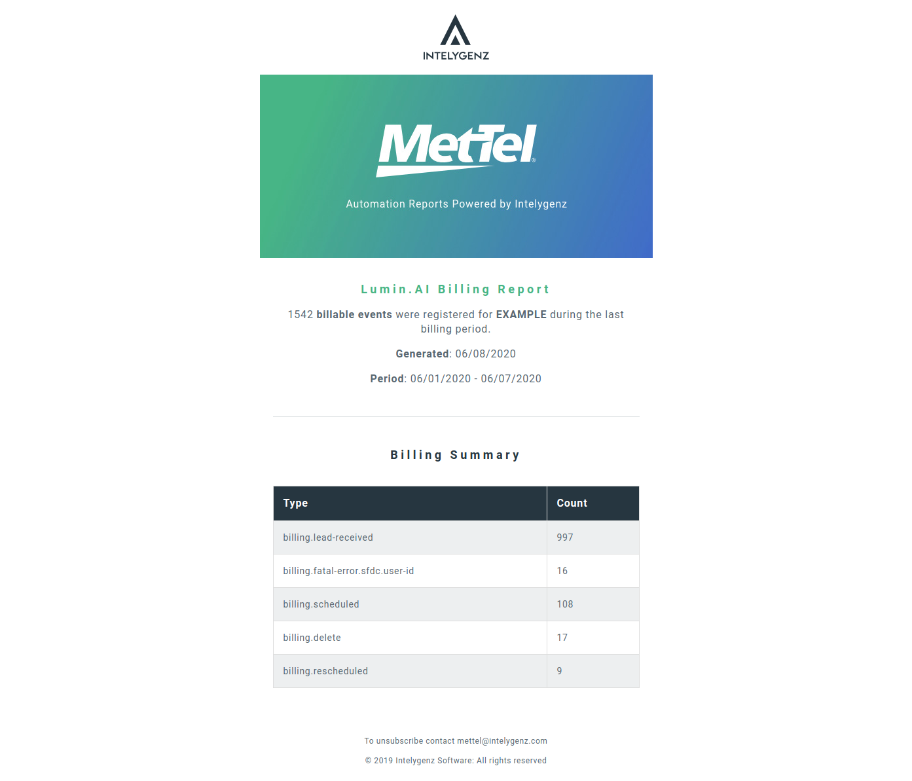

# Table of contents
- [Description](#description)
  * [Components](#components)
  * [Examples](#examples)
- [Workflow](#workflow)
  * [Configuration, environment variables and configuration files](#configuration-environment-variables-and-configuration-files)
  * [Testing](#testing)
  * [Adding new libraries to the project](#adding-new-libraries-to-the-project)
- [Technologies used](#technologies-used)
- [Useful documentation](#useful-documentation)

# Description
This service automates requesting billing information for a given customer from the Lumin.AI service provider,
generating a summary HTML email and attaching a csv with all data for the current billing period.

This service is self-contained, i.e., it does not require access to NATS or Redis, or any other
microservice within the Automation Engine.


## Components

- ***clients/EmailClient***
    Interface for SMTP client.
- ***clients/LuminBillingClient***
    Interface for Lumin.AI Billing REST API. See [documentation](readme-resources/lumin-ai-billing-api.pdf).
- ***repositories/LuminBillingRepository***
    Main entrypoint for service access to Lumin.AI Billing API. Has one method that returns _all_ results for a given 
    date range and billing event type.
- ***repositories/TemplateRenderer***
    Template renderer for lumin billing report template and accompanying csv file.
- ***actions/BillingReport***
    Main report building logic, triggered on first day of month as APScheduler asyncio cron.

## Examples

And a sample csv [attachment](readme-resources/examples/lumin-example.csv)


# Workflow
- Install python 3.6
- Install pip for python 3.6
- Install virtualenv for python 3.6
- Add the [precommit hook for PEP8](https://github.com/cbrueffer/pep8-git-hook) to automation-engine/.git/hooks/

Then create and activate the virtualenv like this:
````
python3 -m venv base-microservice-env
source ./base-microservice-env/bin/activate
pip install -r requirements.txt
````
Starting the application can be achieved by simply running:
````
python src/app.py
````
Starting a standalone version of the service to locally generate a html and csv report can be achieved by:
````
python src/script.py
````
This command will generate a new folder ``report`` which contains an html and a csv file

## Configuration, environment variables and configuration files
Some of the configuration parameters can change between environments.
That's why the config module is there: a centralized file to keep both environment and constant parameters
needed for our service to work.

The [.template.env](/src/config/.template.env) file is an example, without values, of all the parameters from environment variables the service needs to work.
You should ask for an env file to place under the config folder. That file should have the values of the environment variables set.

Make sure you use `source env` from the config directory or that **you point pycharm what env file to use before execute the service**
To use it from local environment execution, you should write `export` before each variable definitions.

The module [config](src/config/config.py) loads in a map all variables from the environment before each execution. If any is not present, the service won't get up and running.
The module [testconfig](src/config/testconfig.py) loads values in a map that is the same as the [config module](src/config/config.py) one, but the values are **NEVER FETCHED FROM ENVIRONMENT VARIABLES** that way we keep our pipelines of unit tests clean.

## Testing
Currently we are working with pytest.
The test configurations can be found in the files [pytest.ini](pytest.ini) and [.coveragerc](.coveragerc)

For writing new tests you must replicate the application directory folder structure inside the test folder.

So we have something like
    - application
        - somepackage
            - somemodule.py
    - tests
        -somepackage
            -somemodule_test.py
            
Test files put under tests directory will be auto-discovered by pytest as long as their module name ends with *_test.py
To run the test suite of a service, navigate to the root of the project (in this case, bruin-bridge) and type `pytest --cov` in a shell.
Pycharm can also be easily configured for that purpose, in order to debug tests.

## Adding new libraries to the project

With virtualenv activated

````
pip install some-package
pip freeze | grep -v "pkg-resources" > requirements.txt #The grep -v is needed only if you use Ubuntu due a harmless bug
````
**Remember to commit the new requirements.txt file**

**VERY IMPORTANT: If the microservice is using any custompackages, change any line related with them after each pip freeze for a relative import. I.E: If you are using velocloud package, change `velocloud==3.2.19` line to `../custompackages/velocloud`**

# Technologies used

- [ASGI library for async](https://pypi.org/project/asgiref/)
- [aiohttp](https://github.com/aio-libs/aiohttp)

### For testing:
- [aioresponses](https://github.com/pnuckowski/aioresponses) (for aiohttp mocking)
- [asynctest](https://github.com/Martiusweb/asynctest) (general asyncio mocking)

# Useful documentation
- [Python async simplified with asgiref and asyncio](https://www.aeracode.org/2018/02/19/python-async-simplified/)
- [Getting started with testing in Python](https://realpython.com/python-testing/#choosing-a-test-runner)
- [Pytest documentation](https://docs.pytest.org/en/latest/getting-started.html)
